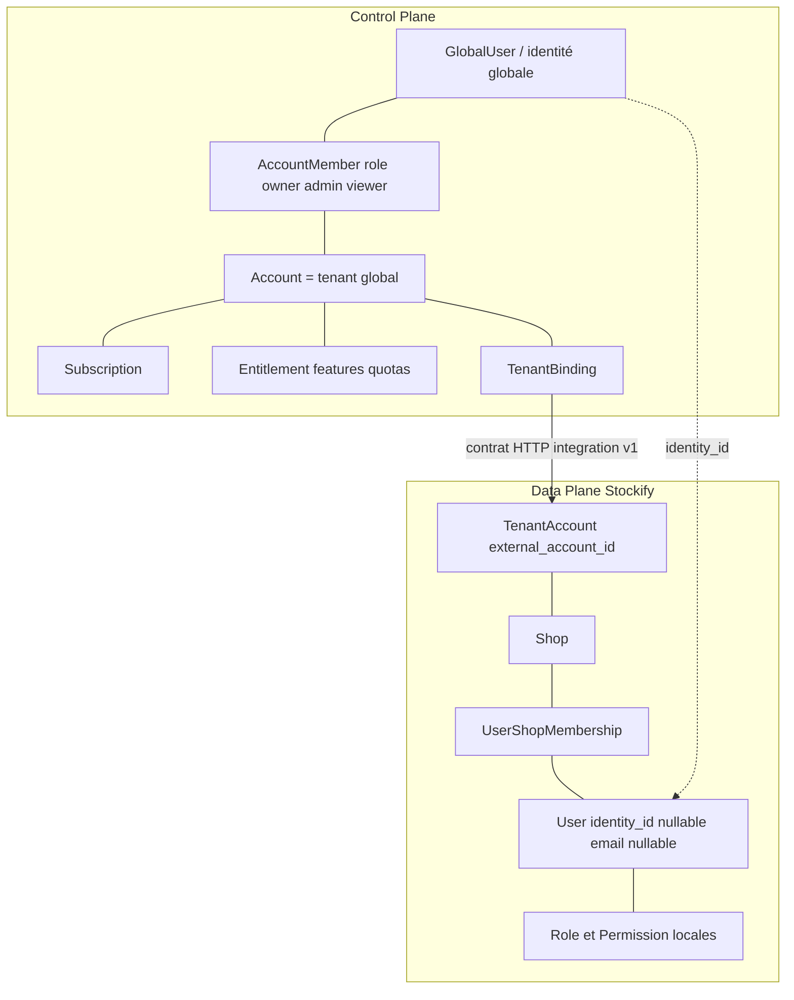
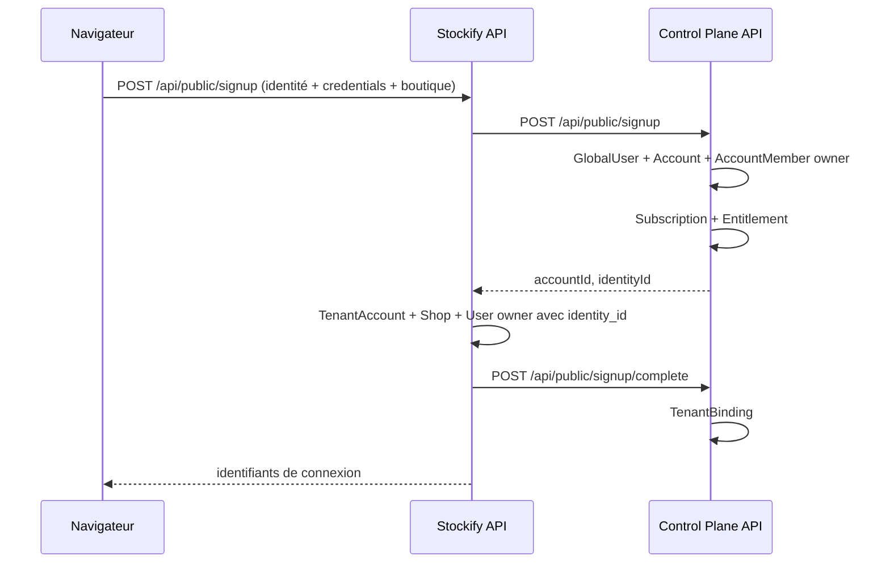
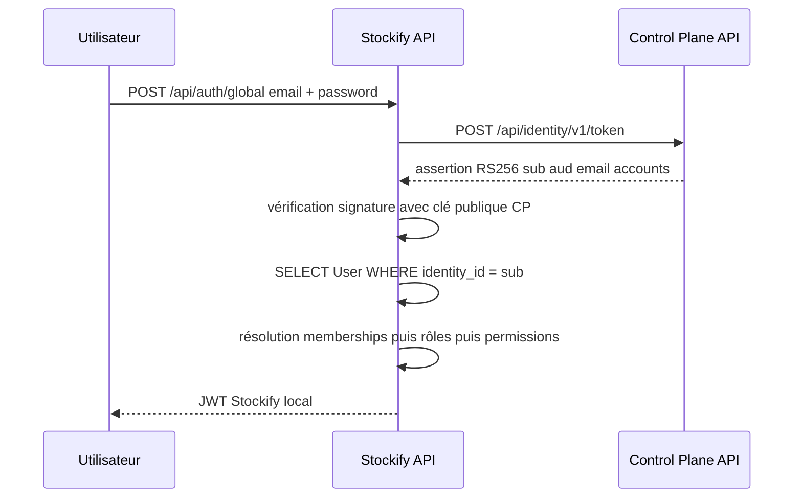
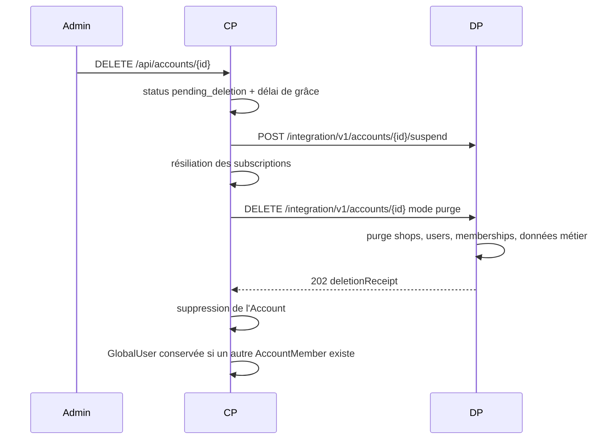

# Plan de migration Stockify vers l'architecture SaaS Control Plane / Data Plane

Document de planification produit après audit réel des deux repositories.

Référence fonctionnelle : `ARCHITECTURE D'AUTHENTIFICATION GÉNÉRIQUE DU SAAS CONTROL PLANE`.

Documents liés :

- [sim-saas-admin/docs/architecture.md](../../sim-saas-admin/docs/architecture.md)
- [sim-saas-admin/docs/auth-architecture.md](../../sim-saas-admin/docs/auth-architecture.md)
- [multi-shop/docs/integration-v1.md](../multi-shop/docs/integration-v1.md)

---

## 1. Décisions actées

| Décision | Choix |
|----------|-------|
| Data Plane cible | `StockifyWeb/multi-shop` **uniquement** |
| Sort de `mono/` | Gelé. Pas de migration de données, ne devient pas une Data Plane |
| Identité globale | Extension de l'entité `GlobalUser` existante du Control Plane |
| Identity Provider OIDC | **Reporté**. Assertion d'identité signée RS256 en v1 |
| Agrégat `Identity` séparé | **Non**. `GlobalUser` joue ce rôle |

---

## 2. Résumé de l'architecture actuelle

### 2.1 Control Plane — `sim-saas-admin`

Repository séparé. Symfony 7.4, PHP >= 8.2, Doctrine ORM 3, MariaDB, Vue 3 + PrimeVue. Pas de Messenger, pas de queue, cache filesystem.

Contextes bornés : `AccountManagement`, `ApplicationCatalog`, `IdentityAccess`, `Integration`, `Billing`, `Monitoring`, `Dashboard`, `System`.

Entités (16) :

| Contexte | Entités |
|----------|---------|
| AccountManagement | `Account`, `AccountMember`, `AccountInvitation`, `Subscription`, `Entitlement`, `TenantBinding` |
| ApplicationCatalog | `Application`, `Plan`, `Feature`, `PlanFeature`, `PlanQuota` |
| IdentityAccess | `GlobalUser` |
| Integration | `IntegrationCredential`, `IntegrationAuditLog` |
| Billing | `BillingEvent` |
| Monitoring | `UsageRecord` |

**Il n'existe pas d'entité `Tenant`.** Le tenant global est l'`Account`. Son lien vers une Data Plane est matérialisé par `TenantBinding (accountId, applicationId, remoteTenantId, remoteShopIds)`.

Billing abstrait derrière `BillingProviderInterface` avec `ManualBillingProvider` et `StripeBillingProvider`, conformément à l'ADR-005. Aucune entité `Invoice` : les événements financiers sont journalisés dans `billing_events`.

### 2.2 Data Plane — `StockifyWeb/multi-shop`

Symfony 7.4, PHP >= 8.2, Doctrine ORM 3, MySQL, Lexik JWT, Vue 3. Pas de Messenger, cache filesystem.

Contextes métier : `Catalog`, `Client`, `Commerce`, `Facturation`, `Finance`, `Fournisseur`, `Inventory`, `Stock`, `Livraison`, `Paiement`, `Impression`, `Analytics`, `Dashboard`.

Contextes transverses : `IdentityAccess`, `AccessAudit`, `Shop`, `Integration`, `Onboarding`, `SharedKernel`.

L'API d'intégration `/integration/v1` est **déjà opérationnelle** :

| Méthode | Path |
|---------|------|
| GET | `/health` (public) |
| GET | `/capabilities` |
| POST | `/accounts` |
| GET | `/accounts/{externalAccountId}` |
| PATCH | `/accounts/{externalAccountId}/entitlements` |
| POST | `/accounts/{externalAccountId}/suspend` |
| POST | `/accounts/{externalAccountId}/activate` |
| DELETE | `/accounts/{externalAccountId}` |
| GET | `/accounts/{externalAccountId}/usage` |
| POST | `/accounts/{externalAccountId}/shops` |
| POST | `/accounts/{externalAccountId}/users/invite` |

### 2.3 Ce qui est donc déjà fait

Par rapport aux phases demandées :

| Phase demandée | État |
|----------------|------|
| Créer le SaaS Admin | **Fait** — repository séparé, base séparée |
| Créer le contrat d'intégration | **Fait** — OpenAPI v1 versionné |
| Implémenter l'Integration API côté Stockify | **Fait** |
| Introduire les externalTenantId | **Fait** — `TenantAccount.external_account_id` |
| Créer Accounts/Tenants globaux | **Fait** |
| Migrer les Shops existants | **Fait** — `integration:migrate-legacy-shops` |
| Connecter subscriptions | **Fait** |
| Connecter entitlements | **Fait** — snapshot local + garde de quota |
| Billing | **Fait** — abstrait, Manual + Stripe |
| Auth backend-to-backend | **Fait** — JWT RS256 + validation `iss`/`aud`/`scope` |
| Memberships multi-boutique (Gap B) | **Fait** — accès via `user_shop_memberships` |
| Email nullable (Gap A) | **Fait** — `legacy_email` + arrêt des `.local` |
| Suppression orchestrée (Gap D) | **Fait** — pending_deletion + purge DP |
| Robustesse du provisioning | **Fait** — Pending→Active, idempotence createShop, resume, retries |
| Identité globale (Gap C) | **Fait** — `identity_id`, `/api/auth/global`, assertion CP RS256, owner signup |
| Résilience des entitlements | **Fait** — pull de secours si snapshot stale + fail-open |

---

## 3. Modèle actuel User / Shop / Tenant

### 3.1 Table `users`

```
id                   BINARY(16)   PK
email                VARCHAR(180) NOT NULL  UNIQUE  uniq_user_email
username             VARCHAR(50)  NOT NULL  UNIQUE (shop_id, username)
password_hash        VARCHAR(255) NOT NULL
first_name           VARCHAR(100) NOT NULL
last_name            VARCHAR(100) NOT NULL
status               VARCHAR      NOT NULL          pending | active | suspended
email_verified_at    DATETIME     NULL
last_login_at        DATETIME     NULL
roles                JSON         NOT NULL
shop_id              BINARY(16)   NULL
tenant_account_id    BINARY(16)   NULL
is_platform_owner    TINYINT      NOT NULL
must_change_password TINYINT      NOT NULL DEFAULT 0
created_at           DATETIME     NOT NULL
updated_at           DATETIME     NOT NULL
```

Aucun champ `identity_id`. Aucune entité `Employee`, `Membership` ou `Account` locale.

### 3.2 Chaîne de tenancy

```
CP Account (UUID)
   |  external_account_id
   v
DP TenantAccount
   |  tenant_account_id
   v
Shop (1..N)
   |  shop_id
   v
User (0..N)
```

### 3.3 Autorisation

Deux couches superposées :

1. Rôles Symfony dans la colonne JSON `users.roles`, utilisés par le firewall.
2. RBAC en base : `roles`, `permissions`, `role_permissions`, `user_roles`, `user_permissions`, avec 79 codes de permission déclarés dans `PermissionCatalog`, résolus par `PermissionVoter` et `PermissionResolverService` (cache 300 s).

Rôles prédéfinis : `admin`, `gerant`, `caissier`, `magasinier`, `comptable`, `consultant`.

### 3.4 Authentification

`json_login` sur `POST /api/login_check`, `username_path: email`, hasher Symfony `auto`, JWT Lexik RS256, TTL 3600 s.

`LoginRequestSubscriber` normalise déjà un corps de requête acceptant `identifier`, `email` ou `username`, plus un `shop_slug` optionnel. `AuthUserResolver` sait résoudre par email, par username, ou par couple username + shop. **Le seam d'authentification par username existe donc déjà.**

Points manquants : pas de reset password self-service, pas de logout serveur, refresh tokens présents en base mais non branchés sur le login ni utilisés par le frontend.

---

## 4. Modèle cible

### 4.1 Réponses aux questions structurantes

**Le Shop représente-t-il le Tenant métier ?** Non. Le `Shop` est la boutique métier. Le tenant local est déjà `TenantAccount`. Un tenant peut porter plusieurs boutiques. Rien à renommer.

**Faut-il créer une entité Tenant dans Stockify ?** Non. `TenantAccount` remplit ce rôle et porte déjà `external_account_id` vers le Control Plane.

**Comment représenter un Account global ?** Il reste dans le Control Plane. Le Data Plane n'en détient qu'une référence opaque, `external_account_id`.

**Comment relier SaaS Admin Tenant et Stockify Shop ?** Via `TenantBinding` côté CP (`remoteTenantId`, `remoteShopIds`) et `Shop.tenant_account_id` côté DP. Les deux liens existent.

**Comment relier une identité globale à un utilisateur Stockify ?** Nouveau champ `users.identity_id`, nullable et unique. L'utilisateur local reste l'entité de référence pour le métier.

**Comment représenter un utilisateur local ?** `User` avec `username`, `password_hash`, `email = NULL`, membership vers une ou plusieurs boutiques, rôles locaux.

**Comment distinguer les profils ?**

| Profil | Marqueurs |
|--------|-----------|
| Owner global | `identity_id` non nul + `AccountMember.role = owner` côté CP |
| Owner local | rôle local `admin`, `identity_id` nul |
| Manager | rôle local `gerant` |
| Employee | rôle local `caissier`, `magasinier`, etc. |
| Platform owner | `is_platform_owner = true`, `shop_id` nul |

**Comment un utilisateur peut-il appartenir à plusieurs Shops ?** Nouvelle table `user_shop_memberships`.

**Comment gérer les rôles au niveau Tenant et Shop ?** Les rôles restent locaux. Le rôle de niveau tenant est porté par `AccountMember` côté CP et n'a aucune sémantique métier dans Stockify.

### 4.2 Diagramme cible



Le lien entre `GlobalUser` et `User` est une simple référence par identifiant. Aucune entité ORM n'est partagée entre les deux repositories.

---

## 5. Flux cibles

### 5.1 Inscription d'un owner global

Wizard public (3 étapes) : identité (`firstName`, `lastName`, `phone?`) → connexion (`adminEmail`, `adminPassword`) → boutique (`accountName`, `accountSlug`, `shopPhone?`, `shopAddress?`). Le profil personne est persisté sur le `User` DP ; `GlobalUser` reste email/password.



### 5.2 Login d'une identité globale



L'assertion ne transporte **aucune** permission métier. Le Control Plane répond « qui est cette personne », le Data Plane répond « ce qu'elle peut faire ».

### 5.3 Login d'un utilisateur local

Inchangé.

```
username + password
   -> POST /api/login_check
   -> vérification du password_hash local
   -> memberships puis rôles puis permissions
   -> JWT Stockify
```

Aucun appel au Control Plane.

### 5.4 Utilisateur local devenant global

```
UPDATE users SET identity_id = 'usr_456' WHERE id = ...
```

Les rôles, permissions et memberships métier sont intégralement conservés. L'utilisateur peut ensuite se connecter par l'un ou l'autre canal.

### 5.5 Une identité sur plusieurs Data Planes

`AccountMember` est déjà une relation N..N entre `GlobalUser` et `Account`. Une même identité peut donc être owner d'un Account Stockify et admin d'un Account d'une autre application, chaque Data Plane conservant ses propres utilisateurs locaux.

### 5.6 Suppression d'un tenant



Le Control Plane n'exécute jamais de DELETE dans la base du Data Plane.

---

## 6. Matrice concept actuel vers cible

| Concept actuel | Correspondance cible | Action | Migration | Risque |
|----------------|---------------------|--------|-----------|--------|
| `User` (Stockify) | User local du Data Plane | Adapter : email nullable, ajout `identity_id` | Oui | Élevé (identifiant JWT) |
| `Shop` | Boutique métier, pas le tenant | Conserver tel quel | Non | Nul |
| `TenantAccount` | Tenant local | Conserver | Non | Nul |
| `Account` (CP) | Tenant global | Conserver | Non | Nul |
| Owner | Owner global ou local | Ajouter le cas global | Oui | Moyen |
| Employee | User local + membership | Aucune entité à créer | Non | Nul |
| Membership | `user_shop_memberships` | Fait — accès shop via memberships | Oui | Moyen |
| `Role`, `Permission` | Restent locaux | Conserver, ne pas remonter au CP | Non | Nul |
| `password_hash` local | Reste local | Conserver | Non | Nul |
| `email` obligatoire | Nullable | Fait — `legacy_email` pour `.local` | Oui | Élevé |
| `username` | Identifiant d'authentification principal | Promouvoir (AUTH_IDENTIFIER) | Oui | Élevé |
| Faux emails `.local` | Supprimés | Fait — nullifiés vers `legacy_email` | Oui | Moyen |
| `Subscription`, `Plan`, `Feature` | CP uniquement | Aucun changement DP | Non | Nul |
| `Entitlement` | Possédé CP, projeté DP | Conserver | Non | Nul |
| `GlobalUser` | Identité globale | Enrichir | Oui | Faible |

---

## 7. Écarts identifiés et corrections

### Gap E — Sécurité et isolation (priorité 1)

**E1. Isolation métier incomplète.** Les entités `Vente`, `VenteLine`, `Commande`, `CommandeLine`, `Devis`, `DevisLine`, `Facture`, `FactureLine`, `Avoir`, `AvoirLine` n'implémentent pas `ShopScopedInterface` et n'ont pas de colonne `shop_id`. Le filtre Doctrine `shop_scope` ne les protège pas. Les ventes et factures sont donc visibles entre boutiques d'un même déploiement, donc entre tenants.

**E3. Le filtre `shop_scope` ne filtrait rien.** Découvert pendant l'implémentation de E1. `ShopContextSubscriber` passait au filtre une chaîne RFC 4122 pré-encadrée de quotes, alors que `SQLFilter::getParameter()` requote systématiquement la valeur. Le prédicat généré comparait de plus une colonne `BINARY(16)` à un littéral texte. Vérifié en SQL : `shop_id = '019fd1b4-...'` renvoie 0 ligne là où `shop_id = UNHEX('019fd1b43a85...')` en renvoie 1. Conséquence : toute requête sur une entité scopée retournait un ensemble vide dès que le filtre était actif, et l'isolation supposée n'existait pas. Corrigé en passant la représentation hexadécimale et en générant `shop_id = UNHEX(:shop_id)`.

**E2. Validation des tokens M2M insuffisante.** `IntegrationJwtValidator` ne contrôle que la signature et la validité temporelle. Les claims `aud`, `iss` et `scope` sont ignorés : un token émis pour une autre application est accepté avec tous les droits. Le webhook `usage` est de plus accepté sans signature si `INTEGRATION_WEBHOOK_SECRET` est vide.

### Gap B — Appartenance mono-boutique — **Fait**

Table `user_shop_memberships` + dual-write `users.shop_id`. L'accès boutique est désormais membership-based (`belongsToShop`) : un `tenant_account_id` ne donne plus accès à toutes les shops du tenant. API `POST|DELETE /api/shops/{shopId}/users/{userId}/membership`. Invite / create shop admin idempotent si l'email existe déjà sur le même tenant.

### Gap A — Email obligatoire — **Fait**

`users.email` est nullable. Les adresses `%.local` existantes sont copiées dans `legacy_email` puis nullifiées (migration `Version20260805140000`). `CreateShopUser` et create shop admin sans `admin_email` n'émettent plus d'emails synthétiques. `getUserIdentifier()` honore `AUTH_IDENTIFIER` (défaut `email`, fallback `email ?? username`).

### Gap D — Suppression non orchestrée — **Fait**

CP : `DELETE /api/accounts/{id}` → `pending_deletion` + grâce (`TENANT_DELETION_GRACE_DAYS`, défaut 30) + suspend DP + cancel subscriptions. Finalisation via `account:finalize-deletions`. DP : `DELETE /integration/v1/accounts/{id}?mode=guard|purge` ; purge sous `TENANT_PURGE_ENABLED` → 202 `deletion_receipt`.

### Gap C — Absence de seam d'identité globale — **Fait**

`users.identity_id` nullable unique côté DP. `POST /api/auth/global` (flag `AUTH_GLOBAL_IDENTITY_ENABLED`) échange email/password via CP `POST /api/identity/v1/token` (HMAC) contre assertion RS256, puis JWT Lexik local. Signup CP crée `GlobalUser` + `AccountMember` owner et retourne `identityId`. `GlobalUser.status` (active/suspended). MFA et `emailVerifiedAt` reportés.

### Robustesse du provisioning — **Fait**

Resume idempotent sans Messenger : Account créé en `Pending` puis `Active` après binding ; flush immédiat du `TenantBinding` après `createShop` ; `createShop` honore `Idempotency-Key` + reprise même slug sous le même tenant ; `HttpIntegrationClient` retry une fois sur 5xx/timeout si clé d'idempotence ; `PublicSignupService` retry `completeSignup` + `bindingPending` ; commandes `account:resume-provisioning` (CP) et `onboarding:reconcile-bindings` (DP).

---

## 8. Contrat d'intégration

Le contrat est versionné sous `/integration/v1`, indépendant de Symfony et de Doctrine. Il est déclaré dans `sim-saas-admin/docs/integration-contract-v1.openapi.yaml`.

Ajouts prévus par ce plan :

| Méthode | Path | Objet |
|---------|------|-------|
| POST | `/accounts/{id}/users/invite` | Déjà implémenté, à déclarer dans l'OpenAPI |
| DELETE | `/accounts/{id}` | Paramètre `mode` : `guard` (défaut) ou `purge` |

Une future `/integration/v2` reste possible : `Application.contractVersion` détermine déjà le préfixe appelé par le Control Plane.

### Authentification backend-to-backend

Choix retenu : **JWT asymétrique RS256 signé par le Control Plane**, TTL 300 s, conformément à l'ADR-003. Justification : aucune infrastructure supplémentaire, pas de secret partagé transitant sur le réseau, le Data Plane n'a besoin que de la clé publique. OAuth2 Client Credentials imposerait un serveur d'autorisation et un aller-retour supplémentaire sans bénéfice au niveau de maturité actuel. mTLS imposerait une PKI et une terminaison TLS maîtrisée, non disponibles.

Durcissement apporté : validation de `iss`, de `aud` (slug de l'application) et des `scope` requis par opération. Les secrets ne sont jamais exposés au frontend : ils vivent uniquement dans les variables d'environnement serveur.

---

## 9. Modèle d'authentification cible

| Canal | Mécanisme | Portée |
|-------|-----------|--------|
| Admin plateforme vers CP | Lexik JWT, email + password | Control Plane |
| CP vers DP | JWT RS256 M2M, TTL 300 s, scopes | Inter-services |
| DP vers CP | Webhook HMAC-SHA256 | Inter-services |
| Utilisateur local vers DP | Lexik JWT, username + password | Data Plane |
| Identité globale vers DP | Assertion CP RS256 échangée contre un JWT local | Mixte |

Les deux modèles d'utilisateur coexistent en permanence. Un utilisateur sans `identity_id` ne contacte jamais le Control Plane.

---

## 10. Modèle d'autorisation cible

Inchangé et strictement local :

```
User -> UserShopMembership -> Shop
User -> UserRole -> Role -> Permission
User -> UserPermission (override)
```

Les 79 codes de permission métier restent dans `PermissionCatalog`. Aucun ne remonte vers le Control Plane. Le token d'identité globale n'est jamais utilisé comme source de vérité des permissions.

Au-dessus du RBAC, les entitlements du tenant agissent comme une seconde grille, appliquée par `TenantFeatureGuard` : une permission accordée par un rôle peut être refusée si la feature n'est pas incluse dans le plan.

---

## 11. Modèle Billing, Subscription, Entitlement

Le Control Plane calcule les entitlements à partir du plan (`EntitlementResolverService`) et pousse un snapshot vers le Data Plane via `PATCH /accounts/{id}/entitlements`. Le Data Plane stocke ce snapshot dans `TenantAccount.entitlements_snapshot` et l'applique hors ligne.

Stratégie retenue : **push par le Control Plane, complété par un pull de secours** côté Data Plane si `last_synced_at` devient trop ancien.

Politique en cas d'indisponibilité du Control Plane : le dernier snapshot connu reste appliqué. Fail-open sur les features déjà accordées, fail-closed sur toute feature inconnue. Le métier n'est jamais bloqué par une panne du Control Plane.

Stockify n'a aucune connaissance du fournisseur de paiement.

---

## 12. Migration des données existantes

| Donnée | Source | Destination | Transformation | Risque |
|--------|--------|-------------|----------------|--------|
| Shops existants | `shops` | inchangé | rattachement `tenant_account_id` | Faible — commande idempotente existante |
| Tenants | déduits des shops | `tenant_accounts` | UUIDv5 déterministe | Faible |
| Propriétaires | `users` rôle `admin` | inchangé | `identity_id` ajouté ultérieurement, opt-in | Faible |
| Utilisateurs locaux | `users` | inchangé | emails `.local` nullifiés | Moyen |
| Relations User-Shop | `users.shop_id` | `user_shop_memberships` | une ligne par utilisateur, dual-write conservé | Moyen |
| Rôles et permissions | `user_roles`, `user_permissions` | inchangé | aucune | Nul |
| Ventes et factures | `ventes`, `factures` | idem + `shop_id` | backfill par le client ou la boutique de l'auteur | Élevé |
| Abonnements | Control Plane | inchangé | aucune | Nul |

Aucun utilisateur existant n'est supprimé, aucune relation utilisateur-boutique n'est perdue : `users.shop_id` est conservé en parallèle des memberships pendant toute la transition.

---

## 13. Ordre d'implémentation

L'ordre proposé dans la demande initiale ne s'applique pas, les phases 1 à 8 et 10 étant déjà réalisées. Ordre retenu, du risque le plus élevé au plus faible :

1. Gap E1 — isolation `shop_id` sur Commerce et Facturation — **Fait**
2. Gap E2 — durcissement du JWT M2M et des webhooks — **Fait**
3. Gap B — `user_shop_memberships` — **Fait** (memberships font autorité pour l'accès shop)
4. Gap A — email nullable et bascule de l'identifiant — **Fait** (`legacy_email` + nullify `.local`)
5. Gap D — suppression orchestrée — **Fait** (pending_deletion + grâce 30j + purge DP)
6. Robustesse du provisioning — **Fait** (Pending→Active, idempotence createShop, resume, retries)
7. Gap C — identité globale — **Fait** (`identity_id`, `/api/auth/global`, assertion RS256, signup owner)
8. Résilience des entitlements — **Fait** (pull de secours si `last_synced_at` stale + fail-open snapshot)
9. Hygiène du contrat et refresh tokens
10. Tests end-to-end réels

---

## 14. Stratégie de compatibilité

Tous les changements sont additifs.

| Mécanisme | Usage | Justification |
|-----------|-------|---------------|
| Feature flag `AUTH_IDENTIFIER` | Bascule email vers username | Déjà présent |
| Feature flag `AUTH_GLOBAL_IDENTITY_ENABLED` | Active `/api/auth/global` | Isole le nouveau canal |
| Feature flag `TENANT_PURGE_ENABLED` | Active le mode purge | Évite une purge accidentelle |
| Dual-write `shop_id` et memberships | Transition Gap B | Permet le rollback |
| Colonne `legacy_email` | Audit après nullification | Réversibilité |

Le dual-read et le dual-write sont limités au strict nécessaire. Aucun mécanisme de compatibilité n'est introduit ailleurs.

---

## 15. Stratégie de rollback

Chaque migration Doctrine dispose d'un `down()` fonctionnel. Les points d'attention :

- La nullification des emails `.local` est préservée dans `legacy_email`, donc réversible.
- La bascule de `getUserIdentifier()` invalide les JWT en cours. Le rollback est immédiat par changement de variable d'environnement, mais provoque une seconde déconnexion générale.
- Le backfill de `shop_id` sur les ventes est irréversible en pratique : un export complet des tables concernées est obligatoire avant exécution.

---

## 16. Risques

### Risques techniques

- Bascule de l'identifiant d'authentification : déconnexion de tous les utilisateurs actifs.
- Backfill de `shop_id` sur des ventes dont le rattachement à une boutique est ambigu.
- Absence de queue : le provisioning reste synchrone ; reprise via idempotence + commandes `account:resume-provisioning` / `onboarding:reconcile-bindings`.

### Risques de sécurité

- Chemin de clé publique d'intégration codé en dur dans `services.yaml`, ignorant `INTEGRATION_JWT_PUBLIC_KEY` : la validation s'appuyait sur une clé sans rapport avec la paire réellement déployée.
- Tokens M2M actuellement acceptés sans contrôle d'audience : à corriger en priorité.
- Webhooks acceptés sans signature si le secret est vide.
- Fuite de données entre boutiques sur les ventes et factures : impact tenant, priorité maximale.

### Risques de perte de données

- Purge d'un tenant sans délai de grâce.
- Nullification des emails sans sauvegarde préalable.
- Suppression d'une `GlobalUser` encore rattachée à un autre Account.

---

## 17. Tests requis

| Scénario | Portée |
|----------|--------|
| Isolation croisée des ventes entre deux boutiques | Data Plane |
| Nouveau tenant Stockify | Bout en bout |
| Ancien shop migré vers un tenant global | Data Plane |
| Owner avec identité globale | Bout en bout |
| Utilisateur local sans email réel | Data Plane |
| Owner et utilisateurs locaux dans le même tenant | Data Plane |
| Utilisateur local appartenant à plusieurs boutiques | Data Plane |
| Identité globale sur plusieurs Data Planes | Control Plane |
| Suspension puis réactivation d'une subscription | Bout en bout |
| Changement de plan et d'entitlements | Bout en bout |
| Suppression complète d'un tenant | Bout en bout |
| Échec de provisioning puis rejeu | Control Plane |
| Provisioning répété (idempotence) | Bout en bout |
| Control Plane indisponible | Data Plane |
| Data Plane indisponible | Control Plane |
| Token M2M expiré | Data Plane |
| Token M2M avec mauvaise audience | Data Plane |

---

## 18. Décisions nécessitant validation

1. **Fenêtre d'invalidation des sessions** lors du passage de `getUserIdentifier()` de l'email au username.
2. **Portée du rôle de membership** : `user_shop_memberships` porte-t-il un rôle propre à la boutique, ou le rôle reste-t-il global à l'utilisateur ?
3. **Délai de grâce** avant purge d'un tenant, et choix entre purge et anonymisation : **Acté** — grâce 30 jours (`TENANT_DELETION_GRACE_DAYS`) ; hard purge sous `TENANT_PURGE_ENABLED` (pas d'anonymisation v1).
4. **Sort des faux emails existants** : **Acté** — conservation en `legacy_email` puis nullification de `email`.
