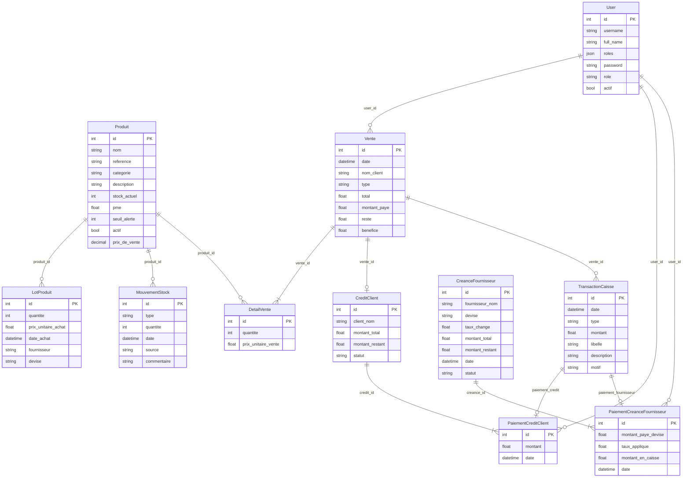

# Architecture de données — Stockify MVC

Documentation du modèle de données Doctrine (`mvc/src/Entity/`).  
**11 entités**, **6 domaines métier**, base relationnelle Symfony/Doctrine ORM.

---

## Vue d'ensemble

Stockify MVC gère :

- le **stock** (produits, lots d'achat, mouvements),
- les **ventes** (transactions et lignes de détail),
- les **crédits clients** et **créances fournisseurs**,
- la **caisse** (transactions financières),
- les **utilisateurs** (authentification).

---

## Diagramme entité-relation



---

## Domaines et entités

| Domaine | Entité | Table | Rôle |
|---------|--------|-------|------|
| Authentification | `User` | `user` | Compte utilisateur Symfony |
| Stock | `Produit` | `produit` | Catalogue et stock courant |
| Stock | `LotProduit` | `lot_produit` | Lot d'achat fournisseur |
| Stock | `MouvementStock` | `mouvement_stock` | Journal des mouvements |
| Ventes | `Vente` | `vente` | En-tête de vente |
| Ventes | `DetailVente` | `detail_vente` | Ligne produit vendue |
| Crédits | `CreditClient` | `credit_client` | Crédit ouvert sur une vente |
| Crédits | `PaiementCreditClient` | `paiement_credit_client` | Règlement partiel/total |
| Fournisseurs | `CreanceFournisseur` | `creance_fournisseur` | Dette fournisseur |
| Fournisseurs | `PaiementCreanceFournisseur` | `paiement_creance_fournisseur` | Règlement avec conversion devise |
| Caisse | `TransactionCaisse` | `transaction_caisse` | Flux financier centralisé |

---

## Détail des entités

### 1. `User` — Authentification

| Champ | Type | Contraintes |
|-------|------|-------------|
| `id` | int | PK, auto |
| `username` | string(180) | unique |
| `full_name` | string(180) | unique |
| `roles` | json | — |
| `password` | string | hashé |
| `role` | string(255) | — |
| `actif` | bool | — |

**Relations :** aucune déclarée côté entité. Référencée par `Vente`, `PaiementCreditClient`, `PaiementCreanceFournisseur`.

---

### 2. `Produit` — Catalogue

| Champ | Type | Contraintes |
|-------|------|-------------|
| `id` | int | PK |
| `nom` | string(255) | — |
| `reference` | string(255) | nullable |
| `categorie` | string(255) | — |
| `description` | string(255) | — |
| `stock_actuel` | int | — |
| `pme` | float | prix moyen d'entrée |
| `seuil_alerte` | int | nullable |
| `actif` | bool | — |
| `prix_de_vente` | decimal(10,2) | — |

**Relations entrantes :** `LotProduit`, `MouvementStock`, `DetailVente`.

---

### 3. `LotProduit` — Achats par lot

| Champ | Type | Contraintes |
|-------|------|-------------|
| `id` | int | PK |
| `produit_id` | FK → `Produit` | obligatoire |
| `quantite` | int | — |
| `prix_unitaire_achat` | float | — |
| `date_achat` | datetime | — |
| `fournisseur` | string(255) | nullable, texte libre |
| `devise` | string(3) | nullable |

**Relation :** `ManyToOne` → `Produit`.

---

### 4. `MouvementStock` — Journal stock

| Champ | Type | Contraintes |
|-------|------|-------------|
| `id` | int | PK |
| `produit_id` | FK → `Produit` | obligatoire |
| `type` | string(255) | entrée / sortie |
| `quantite` | int | — |
| `date` | datetime | — |
| `source` | string(255) | origine du mouvement |
| `commentaire` | string(255) | nullable |

**Relation :** `ManyToOne` → `Produit`.

---

### 5. `Vente` — Transaction commerciale

| Champ | Type | Contraintes |
|-------|------|-------------|
| `id` | int | PK |
| `date` | datetime | — |
| `nom_client` | string(255) | nullable |
| `type` | string(255) | ex. comptant, crédit |
| `total` | float | — |
| `montant_paye` | float | — |
| `reste` | float | solde dû |
| `benefice` | float | — |
| `user_id` | FK → `User` | nullable |

**Relations :**

- `ManyToOne` → `User`
- `OneToMany` → `DetailVente` (`detailsVente`)
- Référencée par `CreditClient`, `TransactionCaisse`

---

### 6. `DetailVente` — Ligne de vente

| Champ | Type | Contraintes |
|-------|------|-------------|
| `id` | int | PK |
| `vente_id` | FK → `Vente` | obligatoire |
| `produit_id` | FK → `Produit` | obligatoire |
| `quantite` | int | — |
| `prix_unitaire_vente` | float | — |

**Relations :**

- `ManyToOne` → `Vente`
- `ManyToOne` → `Produit`

---

### 7. `CreditClient` — Crédit client

| Champ | Type | Contraintes |
|-------|------|-------------|
| `id` | int | PK |
| `vente_id` | FK → `Vente` | obligatoire |
| `client_nom` | string(255) | nullable, défaut `N/A` |
| `montant_total` | float | défaut `0` |
| `montant_restant` | float | défaut `0` |
| `statut` | string(255) | défaut `En cours` |

**Relations :**

- `ManyToOne` → `Vente`
- `OneToMany` → `PaiementCreditClient` (`paiementCreditClients`, orphanRemoval)

---

### 8. `PaiementCreditClient` — Règlement crédit

| Champ | Type | Contraintes |
|-------|------|-------------|
| `id` | int | PK |
| `credit_id` | FK → `CreditClient` | obligatoire |
| `montant` | float | défaut `0` |
| `date` | datetime | défaut now |
| `user_id` | FK → `User` | nullable |
| `paiementCreditClient_id` | FK → self | nullable, OneToOne |

**Relations :**

- `ManyToOne` → `CreditClient`
- `ManyToOne` → `User`
- `OneToOne` → `PaiementCreditClient` (auto-référence)
- Référencée par `TransactionCaisse`

---

### 9. `CreanceFournisseur` — Dette fournisseur

| Champ | Type | Contraintes |
|-------|------|-------------|
| `id` | int | PK |
| `fournisseur_nom` | string(255) | défaut `N/A` |
| `devise` | string(3) | ex. EUR, USD |
| `taux_change` | float | — |
| `montant_total` | float | défaut `0` |
| `montant_restant` | float | défaut `0` |
| `date` | datetime | — |
| `statut` | string(255) | défaut `En cours` |

**Relation :** `OneToMany` → `PaiementCreanceFournisseur` (`paiement`).

> Pas d'entité `Fournisseur` : le nom est stocké en texte libre.

---

### 10. `PaiementCreanceFournisseur` — Règlement fournisseur

| Champ | Type | Contraintes |
|-------|------|-------------|
| `id` | int | PK |
| `creance_id` | FK → `CreanceFournisseur` | obligatoire |
| `montant_paye_devise` | float | montant en devise étrangère |
| `taux_applique` | float | taux utilisé |
| `montant_en_caisse` | float | montant converti |
| `date` | datetime | — |
| `user_id` | FK → `User` | nullable |

**Relations :**

- `ManyToOne` → `CreanceFournisseur`
- `ManyToOne` → `User`
- Référencée par `TransactionCaisse`

---

### 11. `TransactionCaisse` — Mouvement de caisse

| Champ | Type | Contraintes |
|-------|------|-------------|
| `id` | int | PK |
| `date` | datetime | — |
| `type` | string(255) | — |
| `montant` | float | — |
| `libelle` | string(255) | nullable |
| `description` | string(255) | — |
| `motif` | string(255) | — |
| `vente_id` | FK → `Vente` | nullable |
| `paiement_credit_id` | FK → `PaiementCreditClient` | nullable, OneToOne |
| `paiement_fournisseur_id` | FK → `PaiementCreanceFournisseur` | nullable, OneToOne |

**Relations :**

- `ManyToOne` → `Vente`
- `OneToOne` → `PaiementCreditClient` (cascade persist/remove)
- `OneToOne` → `PaiementCreanceFournisseur`

---

## Flux métier

### Stock

```
LotProduit (achat)  ──►  Produit.stock_actuel
MouvementStock      ──►  Produit.stock_actuel
```

- `LotProduit` enregistre les achats (prix, fournisseur, devise).
- `MouvementStock` trace chaque entrée/sortie avec source et commentaire.
- `Produit.pme` et `Produit.stock_actuel` sont maintenus au niveau applicatif.

### Vente

```
User ──► Vente ──► DetailVente ──► Produit
```

- Une vente regroupe plusieurs lignes (`DetailVente`).
- Chaque ligne lie un produit, une quantité et un prix unitaire.
- `total`, `montant_paye`, `reste` et `benefice` sont calculés sur la vente.

### Crédit client

```
Vente (reste > 0) ──► CreditClient ──► PaiementCreditClient ──► TransactionCaisse
```

- Si le client ne paie pas tout, un `CreditClient` est créé.
- Chaque `PaiementCreditClient` réduit `montant_restant`.
- Le `statut` passe à soldé quand `montant_restant = 0`.

### Créance fournisseur

```
CreanceFournisseur ──► PaiementCreanceFournisseur ──► TransactionCaisse
```

- Dette enregistrée avec devise et taux de change.
- Paiement converti en montant caisse via `taux_applique`.

### Caisse (hub financier)

```
TransactionCaisse
  ├── vente              (encaissement direct)
  ├── paiement_credit    (règlement client)
  └── paiement_fournisseur (décaissement fournisseur)
```

`TransactionCaisse` centralise tous les flux financiers.

---

## Matrice des relations

| Entité source | Relation | Entité cible | Champ Doctrine |
|---------------|----------|--------------|----------------|
| `LotProduit` | ManyToOne | `Produit` | `produit` |
| `MouvementStock` | ManyToOne | `Produit` | `produit` |
| `DetailVente` | ManyToOne | `Vente` | `vente` |
| `DetailVente` | ManyToOne | `Produit` | `produit` |
| `Vente` | ManyToOne | `User` | `user` |
| `Vente` | OneToMany | `DetailVente` | `detailsVente` |
| `CreditClient` | ManyToOne | `Vente` | `vente` |
| `CreditClient` | OneToMany | `PaiementCreditClient` | `paiementCreditClients` |
| `PaiementCreditClient` | ManyToOne | `CreditClient` | `credit` |
| `PaiementCreditClient` | ManyToOne | `User` | `user` |
| `PaiementCreditClient` | OneToOne | `PaiementCreditClient` | `paiementCreditClient` |
| `CreanceFournisseur` | OneToMany | `PaiementCreanceFournisseur` | `paiement` |
| `PaiementCreanceFournisseur` | ManyToOne | `CreanceFournisseur` | `creance` |
| `PaiementCreanceFournisseur` | ManyToOne | `User` | `user` |
| `TransactionCaisse` | ManyToOne | `Vente` | `vente` |
| `TransactionCaisse` | OneToOne | `PaiementCreditClient` | `paiement_credit` |
| `TransactionCaisse` | OneToOne | `PaiementCreanceFournisseur` | `paiement_fournisseur` |

---

## Points d'attention

| Sujet | Détail |
|-------|--------|
| Pas d'entité `Fournisseur` | `fournisseur_nom` et `LotProduit.fournisseur` sont des strings |
| Pas d'entité `Client` | `nom_client` et `client_nom` sont des strings |
| Auto-référence | `PaiementCreditClient.paiementCreditClient` (OneToOne vers self) — à vérifier |
| `User` isolé | Aucune relation inverse déclarée sur l'entité |
| Stock dénormalisé | `Produit.stock_actuel` coexiste avec `MouvementStock` — cohérence gérée en code |
| Devises | Gérées sur `LotProduit` et `CreanceFournisseur`, pas sur `Produit` |

---

## Arborescence des fichiers

```
mvc/src/Entity/
├── User.php
├── Produit.php
├── LotProduit.php
├── MouvementStock.php
├── Vente.php
├── DetailVente.php
├── CreditClient.php
├── PaiementCreditClient.php
├── CreanceFournisseur.php
├── PaiementCreanceFournisseur.php
└── TransactionCaisse.php

mvc/src/Repository/          ← un repository par entité
mvc/migrations/              ← schéma SQL versionné
```
