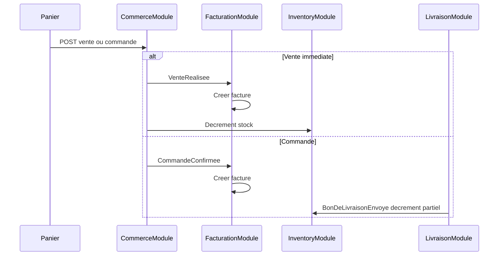

# Conception — Stockify mono (un magasin)

Socle métier pour **une instance = un magasin**. Le multi-tenant SaaS est en pause sous `saas/`.

Référence legacy MVC : [data-model-mvc.md](data-model-mvc.md).  
Modèle de données : [new-data-model.md](new-data-model.md).  
Journal : [v1-implementation-log.md](v1-implementation-log.md).

---

## Vision

1. Authentifier des utilisateurs (JWT).
2. Gérer le catalogue (catégories, produits, variantes, unités de mesure).
3. Gérer le stock (lots, mouvements, politiques FIFO/LIFO/FEFO, alertes).
4. Gérer la **clientèle** (clients, journal, créances).
5. Gérer le **commerce** (panier, ventes immédiates, commandes, livraisons partielles).
6. Gérer la **facturation et les paiements** (factures auto, avoirs, acomptes, créances).
7. Gérer la **trésorerie** (comptes, transactions, modes de paiement).

| Sujet | Décision |
|-------|----------|
| Architecture | Modular monolith Symfony |
| Isolation | Une base / une instance par magasin |
| Stock | Calculé depuis les lots (`SUM(quantity_remaining)`) |
| Modules | Bounded contexts découplés (Catalog, Inventory, Client, Commerce, …) |
| PK | UUID |
| Auth | JWT — pas de headers tenant |
| Inter-modules | Références en colonnes UUID (pas de FK cross-module) |

---

## Modules

| Module | Responsabilité |
|--------|----------------|
| SharedKernel | Traits, événements, exceptions |
| IdentityAccess | User, JWT, login/me/refresh |
| AccessAudit | Rôles, permissions, utilisateurs, journal d'audit |
| Catalog | Catégories, produits, variantes, unités |
| Inventory | Politiques, lots, mouvements, allocations, alertes |
| Client | CRUD clients, soft-delete, journal client |
| Commerce | Ventes, commandes, cycle de vie |
| Facturation | Factures, créances, avoirs (event-driven) |
| Paiement | Enregistrement / annulation paiements |
| Finance | Comptes, transactions, modes de paiement |
| Livraison | Bons de livraison, reste à livrer |
| Fournisseur | CRUD fournisseurs, commandes achat, dettes, décaissements, journal |
| System | Health |

---

## Décisions d'architecture

- **Bounded contexts découplés** : les références inter-modules sont stockées en colonnes UUID sans clé étrangère cross-module (cf. migration `Version20260720120000`).
- **Acheteur** (value object) : client enregistré (`client_id`) ou acheteur anonyme (`anonymous_info`).
- **Créances** : factures marquées `is_creance` avec suivi du solde — modèle différent de l'entité `CreditClient` du MVC legacy.
- **Factures immuables** : corrections via avoirs (notes de crédit), jamais par modification directe.
- **Événements domaine** : orchestration inter-modules (facturation auto, déstockage, restock, clôture créances, transactions caisse).

---

## API (aperçu)

### Auth & système

- `POST /api/login_check`, `POST /api/token/refresh`
- `POST /api/register` (admin uniquement — `access.users.create`)
- `GET /api/me` (inclut `permissions[]`), `GET /api/health`

### Accès & Audit

- `GET|POST /api/users`, `GET|PUT /api/users/{id}`, `POST /api/users/{id}/suspend`, `POST /api/users/{id}/reset-password`
- `GET|POST /api/roles`, `GET|PUT|DELETE /api/roles/{id}`
- `GET /api/permissions`
- `GET /api/audit-logs?user_id=&action=&from=&to=&page=`

### Catalog

- `GET|POST /api/categories`, `PUT|DELETE /api/categories/{id}`
- `GET|POST /api/products`, `GET|PUT|DELETE /api/products/{id}`
- `GET /api/variants`, `GET|POST /api/products/{id}/variants`, `GET|PUT|DELETE /api/variants/{id}`
- `GET /api/units-of-measure`

### Inventory

- `GET|PUT /api/variants/{id}/stock-policy`
- `GET|POST /api/variants/{id}/lots`, `GET /api/variants/{id}/stock`
- `POST /api/variants/{id}/stock-out`, `POST /api/variants/{id}/adjustments`
- `GET /api/stock-movements?variant_id=`, `GET /api/stock-alerts`

### Client

- `GET|POST /api/clients`, `GET|PUT|DELETE /api/clients/{id}`
- `GET /api/clients/{id}/ventes`, `/commandes`, `/factures`, `/creances`, `/paiements`

### Commerce

- `GET|POST /api/ventes`, `GET /api/ventes/{id}`, `POST /api/ventes/{id}/cancel`
- `GET|POST /api/commandes`, `GET /api/commandes/{id}`
- `POST /api/commandes/{id}/confirm`, `POST /api/commandes/{id}/cancel`

### Livraison

- `GET /api/commandes/{id}/reste-a-livrer`
- `GET|POST /api/commandes/{id}/bons-livraison`
- `POST /api/bons-livraison/{id}/delivrer`

### Facturation & paiement

- `GET /api/factures`, `GET /api/factures/{id}`
- `GET /api/creances?client_id=&status=`
- `GET|POST /api/paiements`, `POST /api/paiements/{id}/cancel`

### Finance

- `GET|POST /api/comptes`, `GET|PUT /api/comptes/{id}`, `GET /api/comptes/{id}/solde`
- `GET|POST /api/transactions`, `POST /api/transactions/{id}/cancel`
- `GET|POST /api/modes-de-paiement`, `GET|PUT|DELETE /api/modes-de-paiement/{id}`

### Fournisseur

- `GET|POST /api/fournisseurs`, `GET|PUT|DELETE /api/fournisseurs/{id}`
- `GET /api/fournisseurs/{id}/commandes`, `/dettes`, `/paiements`
- `GET|POST /api/dettes-fournisseur`, `GET /api/dettes-fournisseur/{id}`
- `GET|POST /api/paiements-fournisseur`, `POST /api/paiements-fournisseur/{id}/cancel`
- `GET|POST /api/commandes-fournisseur`, `GET /api/commandes-fournisseur/{id}`
- `POST /api/commandes-fournisseur/{id}/confirm`, `/recevoir`, `/cancel`

---

## Flux commerce



---

## Frontend

Configs magasin dans `mono/frontend/shop-configs/` :

```bash
npm run dev:shop -- --shop=default
npm run build:shop -- --shop=default --env=prod
```

Déploiement multi-boutiques = **une instance mono par boutique** (API + build frontend avec `--shop=<id>`).

### Navigation (sections actives)

| Section | Vues |
|---------|------|
| Application | Dashboard |
| Clientèle | Clientèle, Carnet de dettes, Journal client |
| Catalogue | Produits, Catégories, Mouvements |
| Commerce | Panier, Commandes, Ventes, Paiements |
| Finances | Finances (Comptes, Transactions, Modes de paiement) |

### Dette UI

Vues existantes mais **non routées** dans la navigation : `VariantsView`, `LotsView`, `AlertsView`.

Domaines frontend : `auth/`, `catalog/`, `inventory/`, `client/`, `commerce/`, `finance/`, `layout/`, `shared/`.

---

## Suite SaaS

Quand le métier mono sera stable, il sera réintégré dans `saas/` (Account / Shop / memberships / plateforme).
