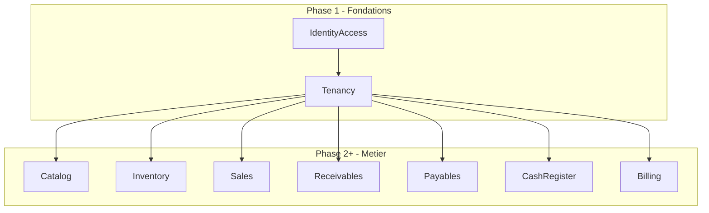
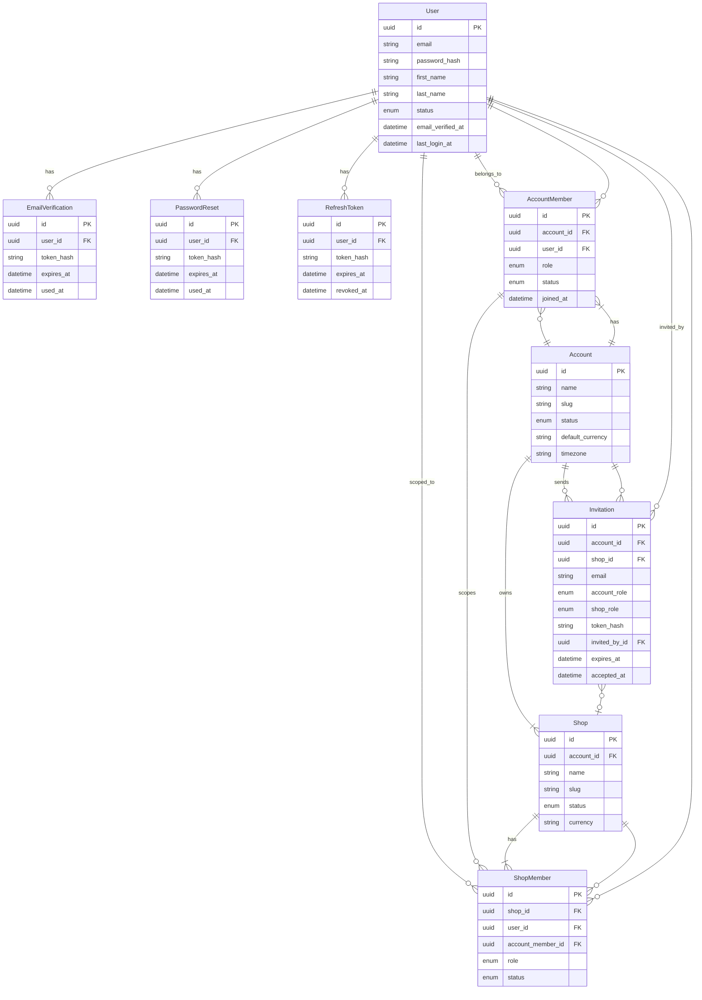
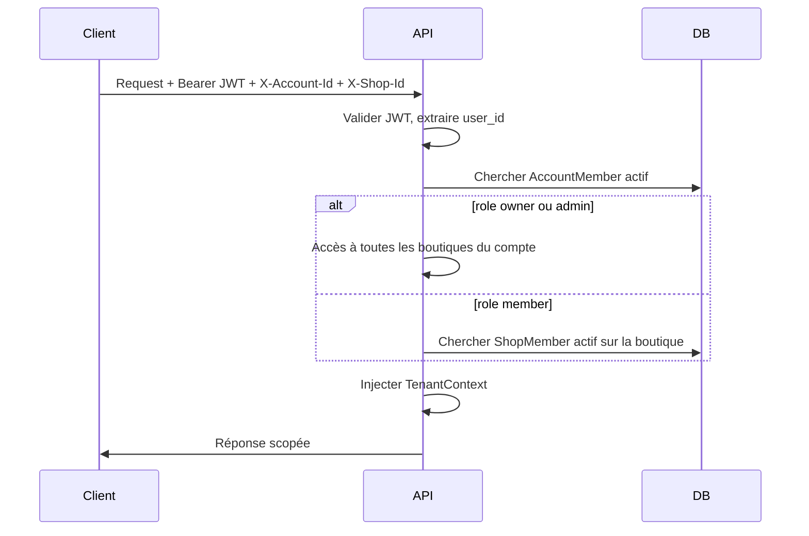
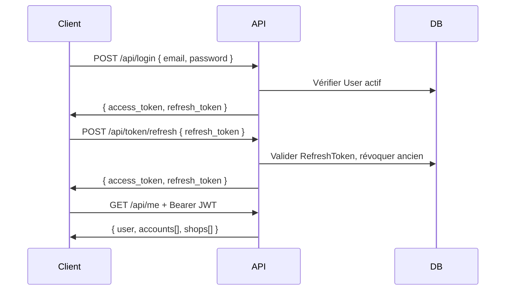

# Modèle de données SaaS — Stockify API

Architecture modulaire du backend API (`api/`) en **modular monolith**, orientée **multi-compte** et **multi-boutique**.

Référence legacy : [data-model-mvc.md](data-model-mvc.md) (application MVC mono-tenant).

---

## 1. Vision

Stockify évolue d'une application mono-boutique vers un **SaaS** où :

- un **compte** (`Account`) représente l'organisation cliente du SaaS (tenant),
- une **boutique** (`Shop`) représente une unité opérationnelle au sein du compte,
- un **utilisateur** (`User`) est une identité globale pouvant appartenir à plusieurs comptes et boutiques.

### Choix d'architecture validés

| Sujet | Décision |
|-------|----------|
| Isolation | Base de données partagée + colonnes `account_id` / `shop_id` |
| Identité | Un email = un `User` global, memberships par compte et par boutique |
| Style | Modular monolith Symfony 7.4 — un module = un dossier sous `api/src/` |
| Auth API | JWT stateless (Lexik) + contexte opérationnel via headers |

### Hiérarchie conceptuelle

```
User (global)
  └── AccountMember ──► Account (tenant)
                            └── Shop (boutique)
                                  └── ShopMember (accès restreint)
```

Les entités métier futures (stock, ventes, caisse) seront toujours rattachées à un `account_id` et, sauf exception, à un `shop_id`.

---

## 2. Carte des domaines



### Phase 1 — Fondations (ce document)

| Module | Responsabilité | Entités |
|--------|----------------|---------|
| `IdentityAccess` | Identité globale, credentials, tokens | `User`, `EmailVerification`, `PasswordReset`, `RefreshToken` |
| `Tenancy` | Compte SaaS, boutiques, memberships, invitations | `Account`, `Shop`, `AccountMember`, `ShopMember`, `Invitation` |

### Phase 2 — Catalogue et Stock V1 (implémentée)

**Décision validée** : le catalogue est **scopé par Shop** — chaque boutique possède son propre catalogue indépendant.

| Module | Entités | Scoping |
|--------|---------|---------|
| `Catalog` | `ProductCategory`, `Product`, `ProductVariant`, `UnitOfMeasure` | account + shop (sauf `UnitOfMeasure` = système) |
| `Inventory` | `StockPolicy`, `StockLot`, `StockMovement`, `StockLotAllocation` | account + shop |

`ProductVariant` est le pivot stock. Politiques de sortie : `fifo`, `lifo`, `fefo`, `manual`.

### Phases suivantes (aperçu)

| Phase | Module | Entités clés | Scoping |
|-------|--------|--------------|---------|
| 2 | `Catalog` + `Inventory` | Voir [v1-design.md](v1-design.md) | account + shop |
| 3 | `Sales` | `Sale`, `SaleLine`, `Customer` | account + shop |
| 4 | `Receivables` | `CustomerCredit`, `CustomerPayment` | account + shop |
| 5 | `Payables` | `Supplier`, `SupplierDebt`, `SupplierPayment` | account (+ shop si pertinent) |
| 6 | `CashRegister` | `CashTransaction` | account + shop |
| 7 | `Billing` | `Plan`, `Subscription`, `Invoice` | account |

### Structure de dossiers cible

```
api/src/
├── SharedKernel/
│   ├── Domain/Trait/
│   └── Infrastructure/Tenant/
├── IdentityAccess/
│   ├── Domain/Entity/
│   ├── Domain/Repository/
│   ├── Application/Service/
│   ├── Presentation/Api/Controller/
│   └── Security/
├── Tenancy/
│   ├── Domain/Entity/
│   ├── Domain/Repository/
│   ├── Application/Service/
│   └── Presentation/Api/Controller/
├── Catalog/
├── Inventory/
├── System/                # health check
└── ...                    # Sales, Receivables, etc.
```

Convention Doctrine : chaque module possède son propre sous-dossier `Domain/Entity/`. Pas de dossier plat `src/Entity/`.

> Détail V1 : voir [v1-design.md](v1-design.md) et journal [v1-implementation-log.md](v1-implementation-log.md).

---

## 3. Conventions

### Identifiants

- **PK** : UUID v7 (ordonnancement temporel, index-friendly)
- Pas d'auto-increment entier sur les nouvelles entités

### Timestamps

Toutes les entités portent :

| Champ | Rôle |
|-------|------|
| `created_at` | Date de création (immutable) |
| `updated_at` | Dernière modification |

### Enums

Stockés en `string` en base, typés en PHP via des backed enums :

```php
enum UserStatus: string { case Pending = 'pending'; case Active = 'active'; case Suspended = 'suspended'; }
```

### Tokens

Les tokens (vérification email, reset password, invitation, refresh) sont **hashés** en base (`token_hash`). Le token en clair n'est transmis qu'une seule fois au client.

### Scoping

| Colonne | Portée | Obligatoire sur |
|---------|--------|-----------------|
| `account_id` | Isolation tenant | Toutes les entités métier |
| `shop_id` | Isolation boutique | Entités opérationnelles (stock, ventes, caisse) |

Index systématiques : `(account_id)`, `(account_id, shop_id)`.

### Nommage

- Entités et modules en **anglais** (code)
- Tables en `snake_case` pluriel : `users`, `accounts`, `shops`, `account_members`

---

## 4. Domaine `IdentityAccess`

Responsabilité : identité globale, credentials, vérification email, réinitialisation mot de passe, tokens de session API.

`User` n'a **aucune FK sortante** vers `Tenancy` — le découplage passe par `AccountMember` / `ShopMember`.

### Entités

| Entité | Rôle |
|--------|------|
| `User` | Identité globale (email unique, mot de passe, profil, statut) |
| `EmailVerification` | Token de vérification d'email (one-time, expirable) |
| `PasswordReset` | Token de réinitialisation (one-time, expirable) |
| `RefreshToken` | Rotation des sessions JWT (recommandé dès la phase 1) |

### 4.1 `User`

| Champ | Type | Contraintes |
|-------|------|-------------|
| `id` | UUID | PK |
| `email` | string(180) | unique, identifiant de connexion |
| `password_hash` | string | — |
| `first_name` | string(100) | — |
| `last_name` | string(100) | — |
| `status` | enum | `pending`, `active`, `suspended` |
| `roles` | json | ex. `ROLE_SUPER_ADMIN` pour l'admin plateforme |
| `email_verified_at` | datetime | nullable |
| `last_login_at` | datetime | nullable |
| `created_at` | datetime | — |
| `updated_at` | datetime | — |

**Relations entrantes :** `EmailVerification`, `PasswordReset`, `RefreshToken`, `AccountMember`, `ShopMember`, `Invitation` (invited_by).

**Cycle de vie :**

1. Inscription → `status = pending`, email non vérifié
2. Vérification email → `status = active`, `email_verified_at` renseigné
3. Suspension admin → `status = suspended`

### 4.2 `EmailVerification`

| Champ | Type | Contraintes |
|-------|------|-------------|
| `id` | UUID | PK |
| `user_id` | FK → User | obligatoire |
| `token_hash` | string(64) | — |
| `expires_at` | datetime | — |
| `used_at` | datetime | nullable |
| `created_at` | datetime | — |

**Relation :** `ManyToOne` → `User`

### 4.3 `PasswordReset`

| Champ | Type | Contraintes |
|-------|------|-------------|
| `id` | UUID | PK |
| `user_id` | FK → User | obligatoire |
| `token_hash` | string(64) | — |
| `expires_at` | datetime | — |
| `used_at` | datetime | nullable |
| `created_at` | datetime | — |

**Relation :** `ManyToOne` → `User`

### 4.4 `RefreshToken`

| Champ | Type | Contraintes |
|-------|------|-------------|
| `id` | UUID | PK |
| `user_id` | FK → User | obligatoire |
| `token_hash` | string(64) | — |
| `expires_at` | datetime | — |
| `revoked_at` | datetime | nullable |
| `created_at` | datetime | — |

**Relation :** `ManyToOne` → `User`

**Stratégie :** à chaque refresh, révoquer l'ancien token et en émettre un nouveau (rotation).

---

## 5. Domaine `Tenancy`

Responsabilité : compte SaaS (client payant), boutiques opérationnelles, appartenances et invitations.

### Entités

| Entité | Rôle |
|--------|------|
| `Account` | Compte SaaS (= tenant / organisation cliente) |
| `Shop` | Boutique opérationnelle au sein d'un compte |
| `AccountMember` | Lien User ↔ Account avec rôle au niveau compte |
| `ShopMember` | Lien User ↔ Shop avec rôle au niveau boutique |
| `Invitation` | Invitation par email à rejoindre un compte (et optionnellement une boutique) |

### 5.1 `Account`

| Champ | Type | Contraintes |
|-------|------|-------------|
| `id` | UUID | PK — **racine du scoping tenant** |
| `name` | string(255) | — |
| `slug` | string(100) | unique global |
| `status` | enum | `trial`, `active`, `suspended`, `closed` |
| `default_currency` | string(3) | ex. `XOF`, `EUR` |
| `timezone` | string(50) | ex. `Africa/Abidjan` |
| `created_at` | datetime | — |
| `updated_at` | datetime | — |

**Relations :**

- `OneToMany` → `Shop`
- `OneToMany` → `AccountMember`
- `OneToMany` → `Invitation`

### 5.2 `Shop`

| Champ | Type | Contraintes |
|-------|------|-------------|
| `id` | UUID | PK |
| `account_id` | FK → Account | obligatoire |
| `name` | string(255) | — |
| `slug` | string(100) | unique par account (index composite) |
| `status` | enum | `active`, `inactive` |
| `currency` | string(3) | nullable, override devise du compte |
| `address` | text | nullable |
| `phone` | string(30) | nullable |
| `created_at` | datetime | — |
| `updated_at` | datetime | — |

**Relations :**

- `ManyToOne` → `Account`
- `OneToMany` → `ShopMember`

> Une boutique = périmètre opérationnel pour stock, ventes et caisse. Toutes les entités métier futures porteront `account_id` + `shop_id`.

### 5.3 `AccountMember`

| Champ | Type | Contraintes |
|-------|------|-------------|
| `id` | UUID | PK |
| `account_id` | FK → Account | obligatoire |
| `user_id` | FK → User | obligatoire |
| `role` | enum | `owner`, `admin`, `member` |
| `status` | enum | `active`, `invited`, `suspended` |
| `joined_at` | datetime | nullable |
| `created_at` | datetime | — |
| `updated_at` | datetime | — |

**Contrainte :** unique `(account_id, user_id)`

**Relations :**

- `ManyToOne` → `Account`
- `ManyToOne` → `User`
- `OneToMany` → `ShopMember`

**Règles :**

- Un compte a exactement **un** `owner` (le créateur)
- `owner` et `admin` ont accès implicite à **toutes** les boutiques du compte
- `member` n'a accès qu'aux boutiques listées dans `ShopMember`

### 5.4 `ShopMember`

| Champ | Type | Contraintes |
|-------|------|-------------|
| `id` | UUID | PK |
| `shop_id` | FK → Shop | obligatoire |
| `user_id` | FK → User | obligatoire |
| `account_member_id` | FK → AccountMember | nullable, cohérence membership |
| `role` | enum | `manager`, `cashier`, `viewer` |
| `status` | enum | `active`, `suspended` |
| `created_at` | datetime | — |
| `updated_at` | datetime | — |

**Contrainte :** unique `(shop_id, user_id)`

**Relations :**

- `ManyToOne` → `Shop`
- `ManyToOne` → `User`
- `ManyToOne` → `AccountMember`

### 5.5 `Invitation`

| Champ | Type | Contraintes |
|-------|------|-------------|
| `id` | UUID | PK |
| `account_id` | FK → Account | obligatoire |
| `shop_id` | FK → Shop | nullable |
| `email` | string(180) | destinataire |
| `account_role` | enum | `admin`, `member` |
| `shop_role` | enum | nullable, si `shop_id` renseigné |
| `token_hash` | string(64) | — |
| `invited_by_id` | FK → User | obligatoire |
| `expires_at` | datetime | — |
| `accepted_at` | datetime | nullable |
| `created_at` | datetime | — |

**Relations :**

- `ManyToOne` → `Account`
- `ManyToOne` → `Shop` (optionnel)
- `ManyToOne` → `User` (invited_by)

**Flux d'invitation :**

1. Un `owner` ou `admin` envoie une invitation (email + rôle)
2. Le destinataire clique le lien → crée un compte ou se connecte
3. Acceptation → création de `AccountMember` (+ `ShopMember` si boutique ciblée)
4. `accepted_at` renseigné, invitation invalidée

---

## 6. Diagramme entité-relation — Phase 1



---

## 7. Contexte requête API

### JWT (access token)

Claims minimaux :

| Claim | Contenu |
|-------|---------|
| `sub` | `user_id` (UUID) |
| `email` | email de l'utilisateur |
| `iat` / `exp` | émission / expiration |

Le JWT **ne contient pas** `account_id` ni `shop_id` — le contexte opérationnel est résolu par requête.

### Headers de contexte

| Header | Rôle |
|--------|------|
| `X-Account-Id` | Compte actif (UUID ou slug) |
| `X-Shop-Id` | Boutique active (UUID ou slug) |

### Résolution du contexte



### Flux d'authentification



### Endpoints phase 1 (prévus)

| Méthode | Route | Rôle |
|---------|-------|------|
| POST | `/api/register` | Créer un User |
| POST | `/api/login` | Obtenir JWT |
| POST | `/api/token/refresh` | Renouveler JWT |
| POST | `/api/password/forgot` | Demander reset |
| POST | `/api/password/reset` | Réinitialiser mot de passe |
| GET | `/api/me` | Profil + memberships |
| POST | `/api/accounts` | Créer un compte (+ boutique par défaut) |
| GET | `/api/accounts` | Lister les comptes de l'user |
| POST | `/api/accounts/{id}/shops` | Créer une boutique |
| POST | `/api/accounts/{id}/invitations` | Inviter un membre |
| POST | `/api/invitations/{token}/accept` | Accepter une invitation |

---

## 8. Rôles et permissions

### Rôles par niveau

| Niveau | Rôles | Portée |
|--------|-------|--------|
| Compte | `owner`, `admin`, `member` | Gestion compte, invitations, toutes boutiques (owner/admin) |
| Boutique | `manager`, `cashier`, `viewer` | Opérations quotidiennes (stock, ventes, caisse) |

### Matrice de permissions — Phase 1

| Action | owner | admin | member | manager | cashier | viewer |
|--------|:-----:|:-----:|:------:|:-------:|:-------:|:------:|
| Gérer le compte (nom, devise) | ✓ | ✓ | | | | |
| Supprimer le compte | ✓ | | | | | |
| Gérer les boutiques (CRUD) | ✓ | ✓ | | | | |
| Inviter des membres | ✓ | ✓ | | | | |
| Gérer les rôles compte | ✓ | ✓ | | | | |
| Voir toutes les boutiques | ✓ | ✓ | | | | |
| Accéder à une boutique assignée | ✓ | ✓ | ✓ | ✓ | ✓ | ✓ |
| Gérer les membres boutique | ✓ | ✓ | | ✓ | | |

> Pas de table `Permission` en phase 1 — les rôles suffisent (YAGNI). Une table fine pourra être ajoutée si nécessaire.

---

## 9. Règles de scoping multi-tenant

1. **Toute entité métier future** porte `account_id` (obligatoire) et `shop_id` (obligatoire sauf entités purement compte).

2. **Pas de FK cross-tenant** : une vente ne peut référencer qu'un produit du même `account_id` + `shop_id`.

3. **Requêtes systématiquement filtrées** : chaque repository injecte le `TenantContext` courant.

4. **Index DB** sur `(account_id)` et `(account_id, shop_id)` pour toutes les tables métier.

5. **Soft delete** envisagé pour `Account` et `Shop` (`status = closed/inactive`) plutôt que suppression physique.

---

## 10. Matrice des relations — Phase 1

| Entité source | Relation | Entité cible | Champ Doctrine |
|---------------|----------|--------------|----------------|
| `EmailVerification` | ManyToOne | `User` | `user` |
| `PasswordReset` | ManyToOne | `User` | `user` |
| `RefreshToken` | ManyToOne | `User` | `user` |
| `Shop` | ManyToOne | `Account` | `account` |
| `AccountMember` | ManyToOne | `Account` | `account` |
| `AccountMember` | ManyToOne | `User` | `user` |
| `ShopMember` | ManyToOne | `Shop` | `shop` |
| `ShopMember` | ManyToOne | `User` | `user` |
| `ShopMember` | ManyToOne | `AccountMember` | `accountMember` |
| `Invitation` | ManyToOne | `Account` | `account` |
| `Invitation` | ManyToOne | `Shop` | `shop` |
| `Invitation` | ManyToOne | `User` | `invitedBy` |
| `Account` | OneToMany | `Shop` | `shops` |
| `Account` | OneToMany | `AccountMember` | `members` |
| `Account` | OneToMany | `Invitation` | `invitations` |
| `Shop` | OneToMany | `ShopMember` | `members` |
| `User` | OneToMany | `AccountMember` | — (côté AccountMember) |
| `User` | OneToMany | `ShopMember` | — (côté ShopMember) |

---

## 11. Points d'attention

| Sujet | Détail |
|-------|--------|
| Owner unique | Un seul `owner` par `Account` — contrainte applicative |
| Bypass owner/admin | Pas besoin de `ShopMember` pour owner/admin — vérification dans le `TenantContextResolver` |
| Invitation owner | Seul `owner` peut promouvoir un `admin` en `owner` (transfert) |
| Email déjà existant | L'invitation lie le `User` existant au compte, pas de doublon |
| Slug account global | `accounts.slug` unique globalement (sous-domaine futur : `{slug}.stockify.app`) |
| Slug shop par account | `shops.slug` unique par `(account_id, slug)` |
| Tokens hashés | Jamais stocker de token en clair en base |
| Découplage IdentityAccess / Tenancy | `User` ne connaît pas `Account` — seul `AccountMember` fait le lien |

---

## 12. Migration depuis le MVC

Corrections par rapport au modèle legacy ([data-model-mvc.md](data-model-mvc.md)) :

| MVC (mono-tenant) | SaaS (multi-tenant) |
|-------------------|---------------------|
| `User` (rôles Symfony) | `User` global + `AccountMember` / `ShopMember` (rôles par contexte) |
| Pas de notion de compte | `Account` + `Shop` |
| `nom_client` / `client_nom` (string) | `Customer` (entité dédiée, phase 3) |
| `fournisseur` / `fournisseur_nom` (string) | `Supplier` (entité dédiée, phase 5) |
| `Produit.stock_actuel` dénormalisé | `StockMovement` + calcul, scopé par shop |
| `PaiementCreditClient` auto-référence | Supprimée — modèle propre en phase 4 |
| Pas d'isolation | `account_id` + `shop_id` sur chaque entité métier |

---

## 13. Prochaine étape — Implémentation

V1 implémentée — voir [v1-implementation-log.md](v1-implementation-log.md) pour le détail step-by-step.

Prochaines étapes (post-V1) :

1. **Invitations** : flux complet avec email
2. **Sales** : ventes et décrémentation stock automatique
3. **Customer** / **Supplier** : entités dédiées
4. **Billing** : plans et abonnements SaaS
