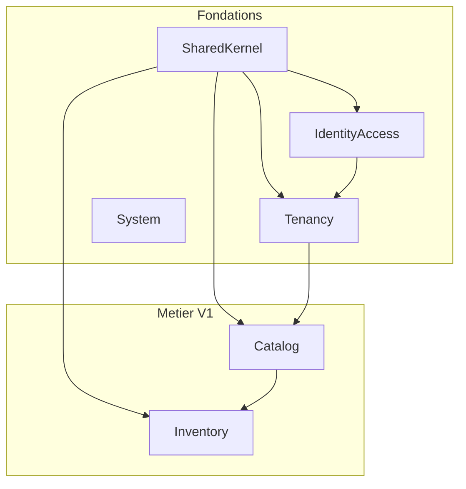
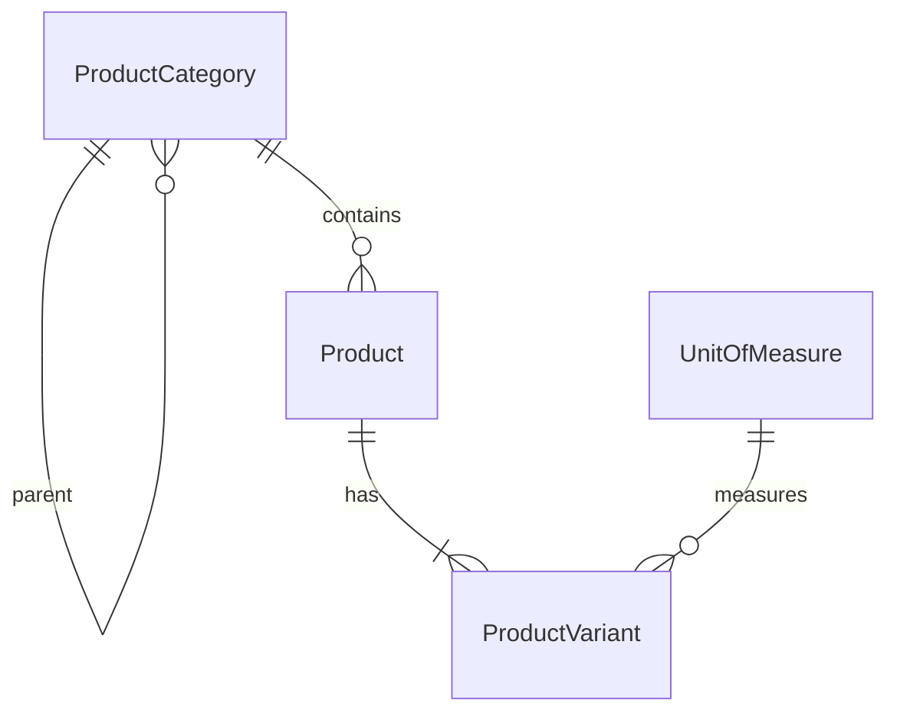
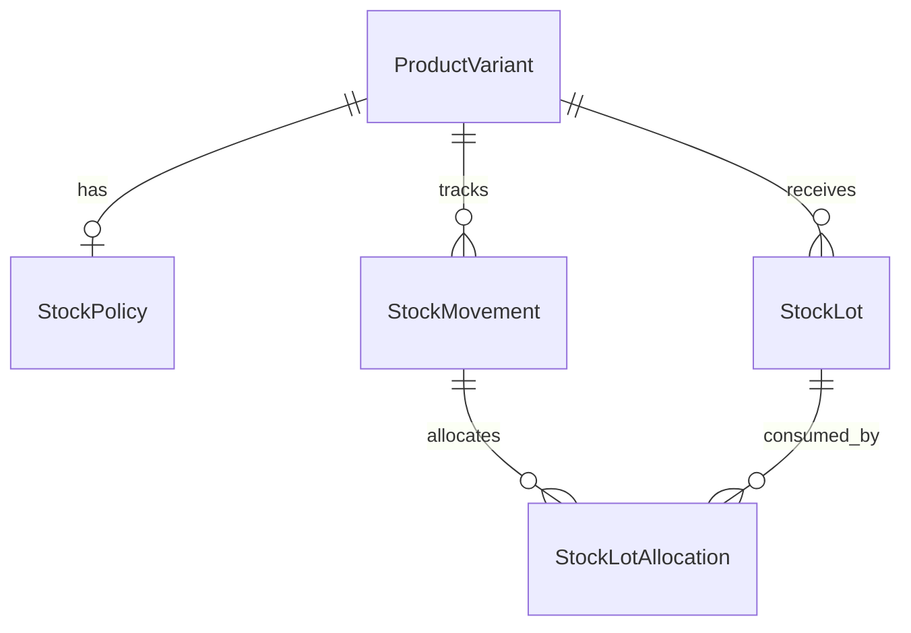
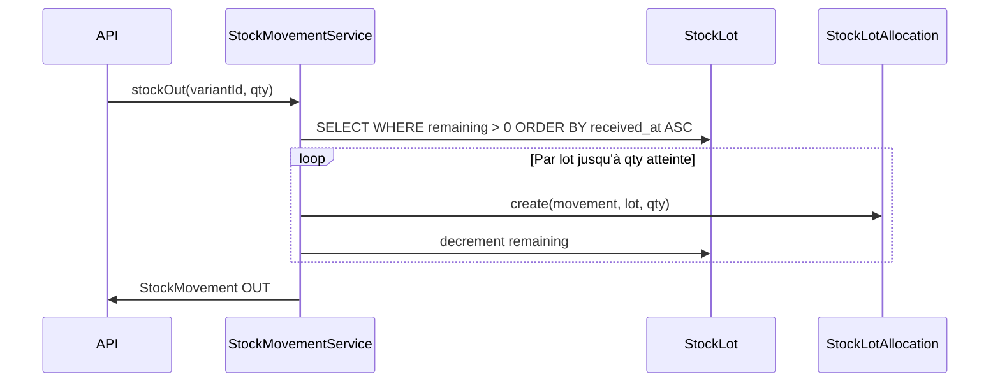
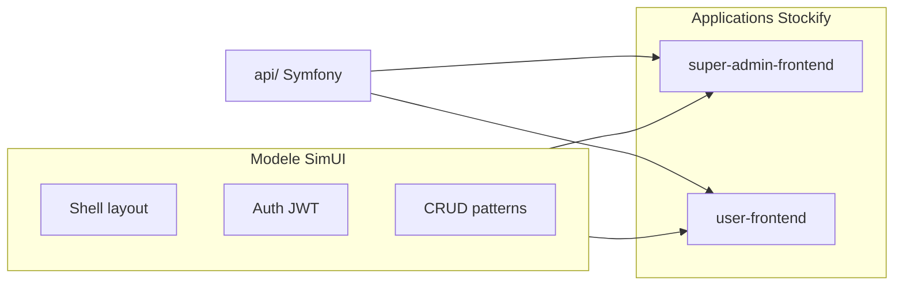
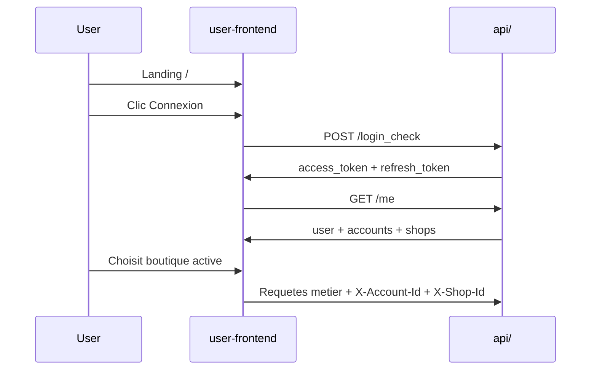
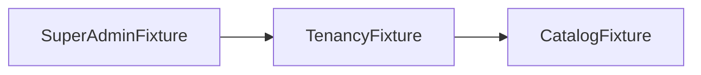

# Conception V1 — Stockify SaaS

Document maître de conception pour la V1 du backend API (`api/`).  
Références : [new-data-model.md](new-data-model.md) (fondations), [data-model-mvc.md](data-model-mvc.md) (legacy).

---

## 1. Vision V1

Stockify V1 permet à une organisation de :

1. **Créer des utilisateurs** et s'authentifier (JWT).
2. **Gérer des comptes et boutiques** (multi-tenant).
3. **Construire un catalogue produit par boutique** (catégories, produits, variantes).
4. **Gérer le stock** (lots, mouvements, politiques FIFO/LIFO/FEFO).

### Décisions validées

| Sujet | Décision |
|-------|----------|
| Architecture | Modular monolith Symfony 7.4 |
| Isolation | Base partagée + `account_id` + `shop_id` |
| Catalogue | **Scope Shop** — chaque boutique a son catalogue indépendant |
| Stock | Calculé depuis les lots (`SUM(quantity_remaining)`), pas de champ dénormalisé |
| Modules stock | `Catalog` (descriptif) + `Inventory` (quantités) séparés |
| PK | UUID v7 |
| Auth | JWT stateless + headers `X-Account-Id` / `X-Shop-Id` |

---

## 2. Modules



| Module | Dossier | Responsabilité |
|--------|---------|----------------|
| SharedKernel | `api/src/SharedKernel/` | Traits, TenantContext, exceptions communes |
| IdentityAccess | `api/src/IdentityAccess/` | User, JWT, register/login/me |
| Tenancy | `api/src/Tenancy/` | Account, Shop, memberships |
| Catalog | `api/src/Catalog/` | Catégories, produits, variantes, unités |
| Inventory | `api/src/Inventory/` | Politiques, lots, mouvements, allocations |
| System | `api/src/System/` | Health check |

### Convention de dossiers

```
api/src/{Module}/
├── Domain/
│   ├── Entity/
│   ├── Repository/
│   ├── Enum/
│   └── Exception/
├── Application/
│   ├── Command/
│   ├── Query/
│   └── Service/
└── Presentation/
    └── Api/
        ├── Controller/
        └── Dto/
```

---

## 3. Scoping multi-tenant

```
User (global)
  └── AccountMember → Account
                          └── Shop
                                ├── ProductCategory, Product, ProductVariant
                                └── StockLot, StockMovement, StockPolicy
```

- JWT claims : `sub` (user_id), `email`
- Headers requis sur routes métier : `X-Account-Id`, `X-Shop-Id`
- `owner` / `admin` : accès implicite à toutes les boutiques du compte
- `member` : accès via `ShopMember` uniquement

---

## 4. Domaine IdentityAccess

### User

| Champ | Type | Contraintes |
|-------|------|-------------|
| id | UUID v7 | PK |
| email | string(180) | unique |
| password_hash | string | — |
| first_name | string(100) | — |
| last_name | string(100) | — |
| status | enum | `pending`, `active`, `suspended` |
| email_verified_at | datetime | nullable |
| last_login_at | datetime | nullable |
| created_at | datetime | — |
| updated_at | datetime | — |

### RefreshToken

| Champ | Type | Contraintes |
|-------|------|-------------|
| id | UUID | PK |
| user_id | FK → User | — |
| token_hash | string(64) | — |
| expires_at | datetime | — |
| revoked_at | datetime | nullable |
| created_at | datetime | — |

Rotation : chaque refresh révoque l'ancien token.

---

## 5. Domaine Tenancy

### Account

| Champ | Type | Contraintes |
|-------|------|-------------|
| id | UUID | PK |
| name | string(255) | — |
| slug | string(100) | unique global |
| status | enum | `trial`, `active`, `suspended`, `closed` |
| default_currency | string(3) | ex. `XOF` |
| timezone | string(50) | ex. `Africa/Abidjan` |
| created_at / updated_at | datetime | — |

### Shop

| Champ | Type | Contraintes |
|-------|------|-------------|
| id | UUID | PK |
| account_id | FK → Account | — |
| name | string(255) | — |
| slug | string(100) | unique `(account_id, slug)` |
| status | enum | `active`, `inactive` |
| currency | string(3) | nullable |
| address | text | nullable |
| phone | string(30) | nullable |
| created_at / updated_at | datetime | — |

### AccountMember

| Champ | Type | Contraintes |
|-------|------|-------------|
| id | UUID | PK |
| account_id | FK | — |
| user_id | FK | — |
| role | enum | `owner`, `admin`, `member` |
| status | enum | `active`, `invited`, `suspended` |
| joined_at | datetime | nullable |

Unique : `(account_id, user_id)`

### ShopMember

| Champ | Type | Contraintes |
|-------|------|-------------|
| id | UUID | PK |
| shop_id | FK | — |
| user_id | FK | — |
| account_member_id | FK | nullable |
| role | enum | `manager`, `cashier`, `viewer` |
| status | enum | `active`, `suspended` |

Unique : `(shop_id, user_id)`

---

## 6. Domaine Catalog (scope Shop)

Toutes les entités portent `account_id` + `shop_id`.

### ProductCategory

| Champ | Type | Contraintes |
|-------|------|-------------|
| id | UUID | PK |
| account_id | UUID | — |
| shop_id | UUID | — |
| parent_id | UUID | nullable, self-FK |
| name | string(255) | — |
| sort_order | int | défaut 0 |
| status | enum | `active`, `inactive` |
| created_at / updated_at | datetime | — |

Unique : `(shop_id, name, parent_id)`

### Product

| Champ | Type | Contraintes |
|-------|------|-------------|
| id | UUID | PK |
| account_id | UUID | — |
| shop_id | UUID | — |
| category_id | FK → ProductCategory | nullable |
| name | string(255) | — |
| reference | string(100) | nullable |
| description | text | nullable |
| status | enum | `active`, `inactive`, `archived` |
| created_at / updated_at | datetime | — |

### UnitOfMeasure

| Champ | Type | Contraintes |
|-------|------|-------------|
| id | UUID | PK |
| code | string(20) | unique (`piece`, `kg`, `liter`, `carton`) |
| label | string(100) | — |
| decimal_places | int | défaut 0 |
| is_system | bool | défaut true |

Table système seedée. Pas de scoping tenant.

### ProductVariant

| Champ | Type | Contraintes |
|-------|------|-------------|
| id | UUID | PK |
| account_id | UUID | — |
| shop_id | UUID | — |
| product_id | FK → Product | — |
| sku | string(100) | unique `(shop_id, sku)` |
| unit_of_measure_id | FK → UnitOfMeasure | — |
| sale_mode | enum | `unit`, `weight`, `volume`, `bundle` |
| default_price | decimal(12,2) | défaut 0 |
| alert_threshold | decimal(12,3) | nullable |
| status | enum | `active`, `inactive` |
| created_at / updated_at | datetime | — |

Unique : `(shop_id, product_id, unit_of_measure_id, sale_mode)`

**Règle** : `ProductVariant` est le pivot stock — toute quantité est rattachée à une variante.

### Diagramme Catalog



---

## 7. Domaine Inventory (scope Shop)

### StockPolicy

| Champ | Type | Contraintes |
|-------|------|-------------|
| id | UUID | PK |
| account_id | UUID | — |
| shop_id | UUID | — |
| variant_id | FK → ProductVariant | unique |
| strategy | enum | `fifo`, `lifo`, `fefo`, `manual` |

Défaut à la création variante : `fifo`.

### StockLot

| Champ | Type | Contraintes |
|-------|------|-------------|
| id | UUID | PK |
| account_id | UUID | — |
| shop_id | UUID | — |
| variant_id | FK → ProductVariant | — |
| reference | string(100) | nullable |
| quantity_initial | decimal(12,3) | > 0 |
| quantity_remaining | decimal(12,3) | >= 0 |
| unit_cost | decimal(12,4) | — |
| received_at | datetime | — |
| supplier_ref | string(255) | nullable |
| expiry_date | date | nullable |
| created_at / updated_at | datetime | — |

### StockMovement

| Champ | Type | Contraintes |
|-------|------|-------------|
| id | UUID | PK |
| account_id | UUID | — |
| shop_id | UUID | — |
| variant_id | FK → ProductVariant | — |
| type | enum | `purchase`, `adjustment`, `transfer`, `sale` |
| direction | enum | `in`, `out` |
| quantity | decimal(12,3) | > 0 |
| unit_cost | decimal(12,4) | nullable |
| reason | string(255) | nullable |
| source_ref | string(255) | nullable |
| performed_by_id | FK → User | nullable |
| occurred_at | datetime | — |
| created_at | datetime | — |

Journal **immuable** — pas de `updated_at`.

### StockLotAllocation

| Champ | Type | Contraintes |
|-------|------|-------------|
| id | UUID | PK |
| movement_id | FK → StockMovement | — |
| lot_id | FK → StockLot | — |
| quantity | decimal(12,3) | > 0 |
| unit_cost | decimal(12,4) | — |

Lie une sortie aux lots consommés (trace FIFO/LIFO).

### Diagramme Inventory



---

## 8. Règles métier Inventory

### Stock disponible

```
available_stock(variant) = SUM(stock_lot.quantity_remaining WHERE quantity_remaining > 0)
```

Pas de champ `stock_actuel` dénormalisé (évite incohérences du legacy MVC).

### Réception lot (IN)

1. Créer `StockLot` avec `quantity_initial = quantity_remaining`.
2. Créer `StockMovement` type `purchase`, direction `in`.

### Sortie stock (OUT)

1. Lire `StockPolicy` de la variante.
2. Sélectionner les lots selon la stratégie :
   - **FIFO** : `received_at ASC`
   - **LIFO** : `received_at DESC`
   - **FEFO** : `expiry_date ASC NULLS LAST`, puis `received_at ASC`
   - **manual** : lots explicitement fournis dans la requête
3. Créer `StockLotAllocation` par lot consommé.
4. Décrémenter `quantity_remaining` sur chaque lot.
5. Créer `StockMovement` type selon contexte, direction `out`.

### Ajustement

- `adjustment` IN : crée un lot « adjustment » ou mouvement sans allocation entrante.
- `adjustment` OUT : applique la politique ou manual.

### Contraintes

- `quantity_remaining` ne descend jamais sous 0.
- Sortie impossible si stock insuffisant → exception `InsufficientStockException`.
- Toute sortie avec policy auto crée au moins une allocation si des lots existent.

### Flux sortie FIFO



---

## 9. API Endpoints V1

### Auth (public)

| Méthode | Route | Description |
|---------|-------|-------------|
| POST | `/api/register` | Créer un utilisateur |
| POST | `/api/login_check` | Login JSON → JWT (Symfony json_login) |
| POST | `/api/token/refresh` | Renouveler JWT |

### Auth (protégé)

| Méthode | Route | Description |
|---------|-------|-------------|
| GET | `/api/me` | Profil + memberships |

### Tenancy

| Méthode | Route | Description |
|---------|-------|-------------|
| POST | `/api/accounts` | Créer compte + shop par défaut |
| GET | `/api/accounts` | Lister comptes de l'utilisateur |
| GET | `/api/accounts/{id}` | Détail compte |
| POST | `/api/accounts/{accountId}/shops` | Créer boutique |
| GET | `/api/shops/{id}` | Détail boutique |

### Catalog

| Méthode | Route | Description |
|---------|-------|-------------|
| GET | `/api/units-of-measure` | Liste unités système |
| GET/POST | `/api/shops/{shopId}/categories` | Lister / créer catégories |
| GET/PUT/DELETE | `/api/shops/{shopId}/categories/{id}` | Détail / modifier / supprimer |
| GET/POST | `/api/shops/{shopId}/products` | Lister / créer produits |
| GET/PUT/DELETE | `/api/shops/{shopId}/products/{id}` | Détail / modifier / supprimer |
| GET/POST | `/api/shops/{shopId}/products/{productId}/variants` | Variantes |
| GET/PUT/DELETE | `/api/shops/{shopId}/variants/{id}` | Détail variante |

### Inventory

| Méthode | Route | Description |
|---------|-------|-------------|
| GET/PUT | `/api/shops/{shopId}/variants/{id}/stock-policy` | Politique sortie |
| POST | `/api/shops/{shopId}/variants/{id}/lots` | Réception lot |
| GET | `/api/shops/{shopId}/variants/{id}/lots` | Lots actifs |
| GET | `/api/shops/{shopId}/variants/{id}/stock` | Stock disponible |
| POST | `/api/shops/{shopId}/variants/{id}/stock-out` | Sortie stock |
| POST | `/api/shops/{shopId}/variants/{id}/adjustments` | Ajustement |
| GET | `/api/shops/{shopId}/stock-movements` | Journal |
| GET | `/api/shops/{shopId}/stock-alerts` | Variantes sous seuil |

### Exemple — Réception lot

```http
POST /api/shops/{shopId}/variants/{variantId}/lots
X-Account-Id: {accountId}
X-Shop-Id: {shopId}
Authorization: Bearer {token}

{
  "quantity": 100,
  "unit_cost": "1500.00",
  "supplier_ref": "FOURN-2024-001",
  "expiry_date": "2026-12-31"
}
```

### Exemple — Sortie FIFO

```http
POST /api/shops/{shopId}/variants/{variantId}/stock-out
{
  "quantity": 25,
  "reason": "Inventaire correction",
  "type": "adjustment"
}
```

### Exemple — Sortie manual

```http
POST /api/shops/{shopId}/variants/{variantId}/stock-out
{
  "quantity": 10,
  "allocations": [
    { "lot_id": "...", "quantity": 6 },
    { "lot_id": "...", "quantity": 4 }
  ]
}
```

---

## 10. Permissions V1

| Action | owner | admin | manager | cashier | viewer |
|--------|:-----:|:-----:|:-------:|:-------:|:------:|
| Gérer compte / boutiques | ✓ | ✓ | | | |
| CRUD catalogue | ✓ | ✓ | ✓ | | |
| Réception lots | ✓ | ✓ | ✓ | ✓ | |
| Sortie / ajustement stock | ✓ | ✓ | ✓ | ✓ | |
| Supprimer produit | ✓ | ✓ | ✓ | | |
| Lecture seule | ✓ | ✓ | ✓ | ✓ | ✓ |

Implémentation : Symfony Voters + rôles dérivés du membership courant.

---

## 11. Migration depuis MVC

| Legacy | V1 SaaS |
|--------|---------|
| `Produit` (stock + prix) | `Product` + `ProductVariant` + Inventory |
| `Produit.categorie` (string) | `ProductCategory` |
| `LotProduit` → Produit | `StockLot` → ProductVariant |
| `MouvementStock` → Produit | `StockMovement` + `StockLotAllocation` |
| `stock_actuel` dénormalisé | `SUM(quantity_remaining)` |
| Pas de FIFO | `StockPolicy` + allocations |
| Mono-tenant | `account_id` + `shop_id` |

---

## 12. Hors scope V1 (backend)

- Module Sales (ventes automatiques)
- Customer / Supplier (entités dédiées)
- Receivables, Payables, CashRegister, Billing
- Transfert inter-boutiques
- Prix multiples / promotions
- Import/export catalogue
- Invitations email (structure prête, flux optionnel)
- **Création comptes/boutiques par l'admin UI** — en V1, provisioning manuel via fixtures ou API directe

---

## 13. Frontends V1 (SimUI) — réalisation ultérieure

Base frontend : **[simui/](../simui/)** (Vue 3 + PrimeVue + Vite).  
Deux applications distinctes dérivées du même modèle :



### 13.1 Structure cible

```
StockifyWeb/
├── simui/              # Modele de reference (ne pas modifier pour la prod)
├── super-admin-frontend/  # Super-admin SaaS (a creer depuis simui/)
├── user-frontend/      # App boutique / catalogue / stock (a creer depuis simui/)
└── api/
```

Commande de bootstrap (documentee, non executee en V1) :

```bash
cp -r simui/ super-admin-frontend
cp -r simui/ user-frontend
```

### 13.2 Super-admin frontend (`super-admin-frontend/`)

| Sujet | Decision |
|-------|----------|
| Entree | **Directement `/login`** — pas de landing |
| Auth | JWT, utilisateur `ROLE_SUPER_ADMIN` |
| Scope | Plateforme SaaS — pas de headers `X-Account-Id` / `X-Shop-Id` |
| Branding | Stockify Super Admin |

**Ecrans V1 (monitoring + provisioning)**

| Route | Ecran | API (a implementer phase admin) |
|-------|-------|--------------------------------|
| `/login` | Connexion super-admin | `POST /api/login_check` |
| `/` | Dashboard monitoring | Comptes actifs, boutiques, sante API |
| `/accounts` | Liste comptes | `GET /api/admin/accounts` (futur) |
| `/accounts/:id` | Detail compte + boutiques | CRUD admin (futur) |
| `/shops` | Vue transverse boutiques | Monitoring (futur) |

> En attendant les endpoints admin dedies, le super-admin peut utiliser les endpoints tenancy existants ou les fixtures de dev.

### 13.3 User frontend (`user-frontend/`)

| Sujet | Decision |
|-------|----------|
| Entree | **`/` = landing simple** (presentation + CTA connexion) |
| Auth | JWT + selection compte/boutique |
| Headers | `X-Account-Id`, `X-Shop-Id` sur toutes requetes metier |
| Branding | Stockify |

**Landing (`/`)**

- Hero court : gestion boutique, catalogue, stock
- Bouton « Se connecter » → `/login`
- Pas d'inscription publique en V1 (comptes crees par l'equipe)

**Ecrans V1 (catalogue + stock)**

| Route | Ecran | API existante |
|-------|-------|---------------|
| `/login` | Connexion | `POST /api/login_check` |
| `/app` | Selection compte / boutique | `GET /api/me` |
| `/catalog/categories` | Categories | CRUD `/api/shops/{id}/categories` |
| `/catalog/products` | Produits | CRUD `/api/shops/{id}/products` |
| `/catalog/variants` | Variantes | CRUD variants |
| `/inventory/lots` | Reception lots | `POST .../lots` |
| `/inventory/movements` | Journal stock | `GET .../stock-movements` |
| `/inventory/alerts` | Alertes seuil | `GET .../stock-alerts` |

### 13.4 Configuration SimUI par app

Chaque frontend surcharge `src/config/app.js` :

```javascript
// super-admin-frontend/src/config/app.js
export const appConfig = {
  app: { name: 'Stockify Super Admin', title: 'Stockify Super Admin' },
  auth: { enabled: true, loginEndpoint: '/login_check', meEndpoint: '/me' },
  routes: { homeRouteName: 'dashboard', loginRouteName: 'login' }
}

// user-frontend/src/config/app.js
export const appConfig = {
  app: { name: 'Stockify', title: 'Stockify' },
  auth: { enabled: true, loginEndpoint: '/login_check', meEndpoint: '/me' },
  routes: { landingRouteName: 'landing', loginRouteName: 'login', homeRouteName: 'dashboard' }
}
```

Variables d'environnement :

```env
VITE_API_URL=http://localhost:8000/api
```

### 13.5 Auth frontend (flux user)



---

## 14. Donnees de demonstration (fixtures)

Chargement dev :

```bash
cd api
php bin/console doctrine:fixtures:load
```

### Ordre et dependances



| Fixture | Fichier | Contenu |
|---------|---------|---------|
| 1 | `SuperAdminFixture.php` | Super-admin plateforme |
| 2 | `TenancyFixture.php` | Compte demo, 2 boutiques, owner + manager |
| 3 | `CatalogFixture.php` | Unites, categories, produits, variantes, lots initiaux |

References partagees : `FixtureReferences.php` (cles `user.*`, `tenancy.*`, `catalog.*`).

### Comptes de test

| Role | Email | Mot de passe |
|------|-------|--------------|
| Super-admin | `admin@stockify.local` | `Admin123!` |
| Owner demo | `owner@demo.stockify.local` | `Demo123!` |
| Manager demo | `manager@demo.stockify.local` | `Demo123!` |

### Donnees tenancy demo

| Entite | Valeur |
|--------|--------|
| Compte | `demo-commerce` — Demo Commerce |
| Boutique principale | `boutique-principale` |
| Boutique secondaire | `boutique-secondaire` |

### Catalogue demo (boutique principale)

- Categories : Boissons, Epicerie
- Produits : Eau minerale 1L, Riz parfume
- Variantes : `EAU-1L-UNIT` (150 unites en stock), `RIZ-KG` (80 kg)
- Politique stock : FIFO par defaut

---

## 15. Index base de données

Sur toutes les tables métier :

- `(account_id)`
- `(account_id, shop_id)`
- `(shop_id, sku)` sur `product_variants`
- `(variant_id, received_at)` sur `stock_lots`
- `(shop_id, variant_id)` sur `stock_movements`
