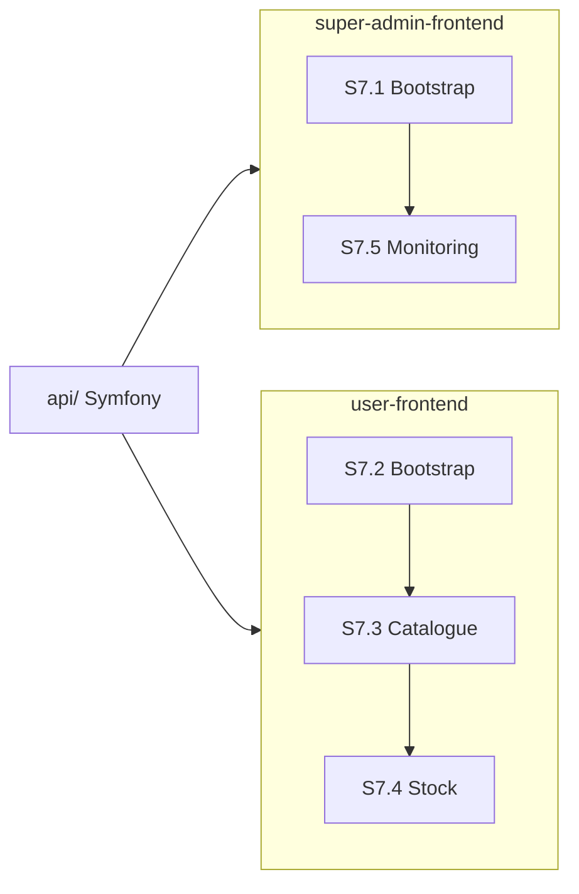

# Journal d'implémentation V1 — Stockify SaaS

Historique step-by-step. **Ne pas passer au step suivant sans validation.**

Légende statuts : `pending` | `in_progress` | `validated` | `blocked`

Référence conception : [v1-design.md](v1-design.md)

---

## Phase 0 — Préparation

### S0.1 — Infra Doctrine / Security / JWT

| Champ | Valeur |
|-------|--------|
| **Statut** | validated |
| **Objectif** | Corriger le mapping Doctrine multi-modules, security.yaml, clés JWT, routing controllers |
| **Livrables** | `doctrine.yaml`, `security.yaml`, `config/jwt/*`, `config/routes/routing.controllers.yaml`, fix HealthController |

**Critères de validation**

- [x] `php bin/console doctrine:mapping:info` liste les entités
- [x] `php bin/console debug:router` fonctionne
- [x] Clés JWT générées dans `config/jwt/`

**Décisions**

- Mapping Doctrine par module sous `Domain/Entity/`
- Login JSON via champ `email` (pas `username`)

**Date validation** : 2026-07-09

---

### S0.2 — SharedKernel

| Champ | Valeur |
|-------|--------|
| **Statut** | validated |
| **Objectif** | Traits réutilisables et TenantContext |
| **Livrables** | `UuidEntityTrait`, `TimestampableTrait`, `TenantScopedTrait`, `TenantContext`, `TenantContextResolver`, `TenantContextSubscriber` |

**Critères de validation**

- [x] Traits utilisables par les entités métier
- [x] TenantContext injectable dans les services

**Date validation** : 2026-07-09

---

## Phase 1 — IdentityAccess

### S1.1 — Entité User SaaS

| Champ | Valeur |
|-------|--------|
| **Statut** | validated |
| **Objectif** | User UUID, enums, migration |
| **Livrables** | `User.php`, `UserStatus.php`, `UserRepository.php`, migration |

**Critères de validation**

- [x] User avec UUID v7, email unique, status enum
- [x] Migration exécutée sans erreur

**Date validation** : 2026-07-09

---

### S1.2 — Auth JWT

| Champ | Valeur |
|-------|--------|
| **Statut** | validated |
| **Objectif** | Register, login, refresh token, UserEnabledChecker |
| **Livrables** | `AuthController`, `RefreshToken`, `UserEnabledChecker`, `RefreshTokenService` |

**Critères de validation**

- [x] POST `/api/register` crée un user
- [x] POST `/api/login_check` retourne JWT
- [x] POST `/api/token/refresh` renouvelle le token
- [x] User `suspended` rejeté au login

**Date validation** : 2026-07-09

---

### S1.3 — Endpoint /api/me

| Champ | Valeur |
|-------|--------|
| **Statut** | validated |
| **Objectif** | Profil utilisateur sans données sensibles |
| **Livrables** | `MeController` |

**Critères de validation**

- [x] GET `/api/me` retourne user sans password
- [x] Requiert JWT valide

**Date validation** : 2026-07-09

---

## Phase 2 — Tenancy

### S2.1 — Entités Account, Shop, AccountMember

| Champ | Valeur |
|-------|--------|
| **Statut** | validated |
| **Objectif** | Modèle multi-tenant de base |
| **Livrables** | `Account`, `Shop`, `AccountMember`, `ShopMember`, repositories, migration |

**Critères de validation**

- [x] Tables créées en base
- [x] Relations FK correctes

**Date validation** : 2026-07-09

---

### S2.2 — TenantContext

| Champ | Valeur |
|-------|--------|
| **Statut** | validated |
| **Objectif** | Résolution headers X-Account-Id / X-Shop-Id |
| **Livrables** | `TenantContextSubscriber`, `ShopAccessVoter` |

**Critères de validation**

- [x] Requête métier sans headers → 403
- [x] owner/admin accèdent à toute boutique du compte

**Date validation** : 2026-07-09

---

### S2.3 — CRUD Account + Shop

| Champ | Valeur |
|-------|--------|
| **Statut** | validated |
| **Objectif** | Création compte avec shop par défaut |
| **Livrables** | `AccountController`, `ShopController`, `CreateAccountService` |

**Critères de validation**

- [x] POST `/api/accounts` crée compte + 1 shop + membership owner
- [x] GET `/api/accounts` liste les comptes de l'utilisateur

**Date validation** : 2026-07-09

---

### S2.4 — ShopMember (optionnel V1)

| Champ | Valeur |
|-------|--------|
| **Statut** | validated |
| **Objectif** | Rôles boutique pour members |
| **Livrables** | `ShopMember` entity, voter intégré |

**Critères de validation**

- [x] member sans ShopMember ne peut pas accéder à la boutique

**Date validation** : 2026-07-09

---

## Phase 3 — Catalog

### S3.1 — UnitOfMeasure seed

| Champ | Valeur |
|-------|--------|
| **Statut** | validated |
| **Objectif** | Unités système (pièce, kg, L, carton) |
| **Livrables** | `UnitOfMeasure`, fixture/migration seed, `UnitOfMeasureController` |

**Critères de validation**

- [x] GET `/api/units-of-measure` retourne 4 unités

**Date validation** : 2026-07-09

---

### S3.2 — ProductCategory CRUD

| Champ | Valeur |
|-------|--------|
| **Statut** | validated |
| **Objectif** | Catégories arborescentes par shop |
| **Livrables** | `ProductCategory`, `CategoryController` |

**Critères de validation**

- [x] CRUD catégorie parent/enfant

**Date validation** : 2026-07-09

---

### S3.3 — Product CRUD

| Champ | Valeur |
|-------|--------|
| **Statut** | validated |
| **Objectif** | Produits liés à une catégorie |
| **Livrables** | `Product`, `ProductController` |

**Critères de validation**

- [x] Produit créé avec shop scoping

**Date validation** : 2026-07-09

---

### S3.4 — ProductVariant CRUD

| Champ | Valeur |
|-------|--------|
| **Statut** | validated |
| **Objectif** | Variantes SKU + unit + sale_mode |
| **Livrables** | `ProductVariant`, `ProductVariantController`, `SaleMode` enum |

**Critères de validation**

- [x] Unicité combinaison (product, unit, sale_mode) par shop
- [x] StockPolicy fifo créée automatiquement

**Date validation** : 2026-07-09

---

## Phase 4 — Inventory

### S4.1 — StockPolicy

| Champ | Valeur |
|-------|--------|
| **Statut** | validated |
| **Objectif** | Politique de sortie par variante |
| **Livrables** | `StockPolicy`, `StockPolicyController` |

**Critères de validation**

- [x] Défaut fifo à la création variante
- [x] GET/PUT policy fonctionnels

**Date validation** : 2026-07-09

---

### S4.2 — Réception lots

| Champ | Valeur |
|-------|--------|
| **Statut** | validated |
| **Objectif** | StockLot + mouvement IN |
| **Livrables** | `StockLot`, `receiveLot` dans `StockMovementService` |

**Critères de validation**

- [x] Lot créé, stock disponible = quantité reçue

**Date validation** : 2026-07-09

---

### S4.3 — Sortie FIFO/LIFO/FEFO

| Champ | Valeur |
|-------|--------|
| **Statut** | validated |
| **Objectif** | Allocations multi-lots selon politique |
| **Livrables** | `StockLotAllocation`, `stockOut` dans `StockMovementService` |

**Critères de validation**

- [x] Sortie 10 sur 2 lots → allocations correctes
- [x] FIFO consomme le lot le plus ancien en premier

**Date validation** : 2026-07-09

---

### S4.4 — Ajustements + journal

| Champ | Valeur |
|-------|--------|
| **Statut** | validated |
| **Objectif** | Mouvements adjustment + listing |
| **Livrables** | `adjust`, `StockMovementController` |

**Critères de validation**

- [x] Historique mouvements filtrable par variant

**Date validation** : 2026-07-09

---

### S4.5 — Alerte seuil

| Champ | Valeur |
|-------|--------|
| **Statut** | validated |
| **Objectif** | Variantes sous alert_threshold |
| **Livrables** | GET `/api/shops/{shopId}/stock-alerts` |

**Critères de validation**

- [x] Retourne variantes dont stock < seuil

**Date validation** : 2026-07-09

---

## Phase 5 — Finitions

### S5.1 — Permissions par rôle

| Champ | Valeur |
|-------|--------|
| **Statut** | validated |
| **Objectif** | Voters Symfony par action |
| **Livrables** | `ShopPermissionVoter` |

**Critères de validation**

- [x] viewer ne peut pas créer produit
- [x] cashier peut recevoir lots mais pas supprimer produit

**Date validation** : 2026-07-09

---

### S5.2 — Tests intégration

| Champ | Valeur |
|-------|--------|
| **Statut** | validated |
| **Objectif** | Scénario complet register → FIFO |
| **Livrables** | `tests/Integration/V1FlowTest.php` |

**Critères de validation**

- [x] Test PHPUnit vert

**Date validation** : 2026-07-09

---

### S5.3 — Docs finalisées

| Champ | Valeur |
|-------|--------|
| **Statut** | validated |
| **Objectif** | Alignement documentation / code |
| **Livrables** | `v1-design.md`, `v1-implementation-log.md`, `new-data-model.md` |

**Critères de validation**

- [x] Docs reflètent l'implémentation

**Date validation** : 2026-07-09

---

## Phase 6 — Donnees de demonstration (S6)

### S6.1 — DataFixtures

| Champ | Valeur |
|-------|--------|
| **Statut** | validated |
| **Objectif** | Jeu de donnees dev coherent (super-admin, tenancy, catalogue) |
| **Livrables** | `SuperAdminFixture`, `TenancyFixture`, `CatalogFixture`, `FixtureReferences` |

**Critères de validation**

- [x] `doctrine:fixtures:load` execute sans erreur
- [x] Super-admin `admin@stockify.local` avec `ROLE_SUPER_ADMIN`
- [x] Compte demo + 2 boutiques + catalogue avec stock initial

**Date validation** : 2026-07-09

---

## Phase 7 — Frontends V1 (S7) — VALIDÉ (code)

> **Objectif release V1** : livrer **deux applications distinctes** dérivées de `simui/`, sans doublon :
>
> | Dossier | Rôle | Utilisateurs |
> |---------|------|--------------|
> | `super-admin-frontend/` | Console plateforme SaaS | `ROLE_SUPER_ADMIN` uniquement |
> | `user-frontend/` | App métier boutique | Owner, admin, manager, cashier, viewer |
>
> Le dossier `admin-frontend/` a été **supprimé** (doublon). Ne pas le recréer.

### Vue d'ensemble — ordre recommandé

| Priorité | Step | App | Bloquant pour V1 |
|----------|------|-----|------------------|
| 1 | S7.1 | super-admin | Oui — auth + shell |
| 2 | S7.5 | super-admin | Oui — monitoring minimal |
| 3 | S7.2 | user | Oui — auth + tenant |
| 4 | S7.3 | user | Oui — catalogue CRUD |
| 5 | S7.4 | user | Oui — stock CRUD |
| 6 | S8.x | les deux | Oui — packaging release |

**État au 2026-07-09** : S7.1–S7.6 implémentés (monitoring super-admin, catalogue, stock user, finitions). Builds `npm run build` OK. Validation manuelle E2E à confirmer via le scénario Phase 8.

**Choix API monitoring (S7.5)** : namespace dédié `GET /api/admin/*` protégé par `ROLE_SUPER_ADMIN` (`AdminPlatformController`), plutôt que contournement des endpoints tenancy membres.

---

### S7.1 — Bootstrap super-admin-frontend

| Champ | Valeur |
|-------|--------|
| **Statut** | validated (code) |
| **Objectif** | Copier `simui/`, config Stockify Super Admin, login direct |
| **Livrables** | `super-admin-frontend/`, auth JWT, shell layout, garde `ROLE_SUPER_ADMIN` |
| **Dépend de** | S6.1 (fixtures super-admin) |

**Critères de validation**

- [ ] `/login` accessible sans landing
- [ ] Connexion super-admin fixture OK (`admin` ou `admin@stockify.local` / `Admin123!`)
- [ ] Utilisateur non super-admin rejeté (logout + redirect login)
- [ ] `npm run build` OK

**Sous-tâches**

- [x] Copier `simui/` vers `super-admin-frontend/`
- [x] Configurer `appConfig` (branding, routes, endpoints API, clés storage dédiées)
- [x] Brancher login JWT sur `/api/login_check` (email ou username dans le champ email)
- [x] Appeler `/api/me` après login et stocker l'utilisateur
- [x] Ajouter garde de route pour exiger `ROLE_SUPER_ADMIN`
- [ ] Remplacer `HomeView` placeholder par un vrai dashboard (voir S7.5)
- [ ] Valider manuellement le flux login → dashboard

**Notes d'implémentation**

- Dossier : `super-admin-frontend/`
- Pas de headers `X-Account-Id` / `X-Shop-Id`
- Dev : `cd super-admin-frontend && npm run dev` (port Vite libre, ex. 5174)

---

### S7.5 — Ecrans super-admin (monitoring)

| Champ | Valeur |
|-------|--------|
| **Statut** | validated (code) |
| **Objectif** | Dashboard SaaS, liste comptes/boutiques (lecture) |
| **Livrables** | Vues dans `super-admin-frontend/` + routes `/`, `/accounts`, `/shops` |
| **Dépend de** | S7.1 validé |

**Critères de validation**

- [ ] Dashboard affiche : santé API (`GET /api/health`), nombre de comptes, nombre de boutiques
- [ ] Liste des comptes avec slug, statut, nombre de boutiques
- [ ] Détail compte : infos + liste des boutiques (lecture seule)
- [ ] Navigation sidebar cohérente (Dashboard, Comptes, Boutiques)

**Sous-tâches**

- [ ] Définir routes `/accounts`, `/accounts/:id`, `/shops` dans `super-admin-frontend/src/router/`
- [ ] Mettre à jour `appConfig.navigation.items` (retirer la doc SimUI placeholder en prod)
- [ ] Créer domaine `domains/platform/` : `platformService.js`, stores, vues
- [ ] Dashboard : cartes stats + lien santé API
- [ ] Liste comptes : table + navigation vers détail
- [ ] **API V1** : décider endpoints admin dédiés (`GET /api/admin/accounts`, etc.) **ou** endpoints tenancy existants avec compte super-admin — documenter le choix
- [ ] Gérer états loading / erreur / vide (patterns SimUI `AppTableState`, `AppStatsCards`)

**Hors scope V1 (super-admin)**

- CRUD provisioning comptes/boutiques depuis l'UI (fixtures + API directe suffisent en V1)
- Invitations email, billing, analytics avancés

---

### S7.2 — Bootstrap user-frontend

| Champ | Valeur |
|-------|--------|
| **Statut** | validated (code) |
| **Objectif** | Copier `simui/`, landing `/`, auth + sélection compte/boutique |
| **Livrables** | `user-frontend/`, `LandingView.vue`, tenant store, headers tenant |
| **Dépend de** | S6.1 (fixtures demo owner/manager) |

**Critères de validation**

- [ ] Landing visible sur `/` avec CTA connexion
- [ ] Flux login → `/app/dashboard` avec sélection compte/boutique
- [ ] Headers `X-Account-Id` et `X-Shop-Id` envoyés sur les requêtes métier
- [ ] Connexion owner demo OK (`owner` ou `owner@demo.stockify.local` / `Demo123!`)
- [ ] `npm run build` OK

**Sous-tâches**

- [x] Copier `simui/` vers `user-frontend/`
- [x] Créer vue `LandingView` avec CTA login
- [x] Configurer `appConfig` (landing, login, dashboard, storage tenant)
- [x] Brancher login JWT sur `/api/login_check` (email ou username)
- [x] Mettre en place appel `/api/me` et stockage comptes/boutiques (`domains/tenancy/stores/tenant.js`)
- [x] Sélecteur compte/boutique sur le dashboard + persistance localStorage
- [x] Injection headers `X-Account-Id` / `X-Shop-Id` dans `lib/axios.js`
- [ ] Garde route : rediriger vers dashboard si tenant non sélectionné avant écrans métier
- [ ] Valider manuellement le flux bout en bout

**Notes d'implémentation**

- Dossier : `user-frontend/`
- Shell protégé sous `/app/*` (pas à la racine `/`)
- Dev : `cd user-frontend && npm run dev` (port Vite libre, ex. 5175)
- Ébauche `domains/stocks/` existante (mock local) — à **remplacer** par l'API Inventory V1 en S7.4

---

### S7.3 — Ecrans catalogue (user-frontend)

| Champ | Valeur |
|-------|--------|
| **Statut** | validated (code) |
| **Objectif** | CRUD catégories, produits, variantes par boutique active |
| **Livrables** | `user-frontend/src/domains/catalog/` — vues, services, stores |
| **Dépend de** | S7.2 validé |

**Critères de validation**

- [ ] Liste + création/édition/suppression catégories (arborescence parent/enfant)
- [ ] Liste + création/édition/suppression produits (liés à une catégorie)
- [ ] Liste + création/édition/suppression variantes (SKU, unité, sale_mode, prix, seuil)
- [ ] Erreurs API affichées proprement (validation 422, forbidden 403)
- [ ] Toutes les requêtes scopées sur la boutique sélectionnée

**Sous-tâches**

- [ ] Routes `/app/catalog/categories`, `/app/catalog/products`, `/app/catalog/variants`
- [ ] Navigation sidebar : section Catalogue (3 entrées)
- [ ] Services API :
  - `GET/POST /api/shops/{shopId}/categories`
  - `GET/PUT/DELETE /api/shops/{shopId}/categories/{id}`
  - `GET/POST /api/shops/{shopId}/products` (+ PUT/DELETE)
  - `GET/POST /api/shops/{shopId}/products/{productId}/variants` (+ PUT/DELETE)
  - `GET /api/units-of-measure` (select unités)
- [ ] Réutiliser patterns SimUI : `AppEntityToolbar`, `AppCrudDialog`, `createCrudService`, `createCrudStore`
- [ ] Filtrage recherche côté liste (minimal, pas de pagination serveur obligatoire en V1)

---

### S7.4 — Ecrans stock (user-frontend)

| Champ | Valeur |
|-------|--------|
| **Statut** | validated (code) |
| **Objectif** | Lots, mouvements, alertes, sortie stock via API Inventory V1 |
| **Livrables** | `user-frontend/src/domains/inventory/` — remplace l'ébauche `domains/stocks/` |
| **Dépend de** | S7.3 validé (besoin de variantes existantes) |

**Critères de validation**

- [ ] Réception lot depuis l'UI crée un `StockLot` + mouvement IN
- [ ] Sortie stock FIFO par défaut depuis l'UI
- [ ] Alertes seuil : variantes sous `alert_threshold`
- [ ] Journal mouvements consultable (filtre variante optionnel)
- [ ] Stock disponible affiché par variante

**Sous-tâches**

- [ ] Routes `/app/inventory/lots`, `/app/inventory/movements`, `/app/inventory/alerts`
- [ ] Supprimer ou migrer `domains/stocks/` (mock) vers `domains/inventory/`
- [ ] Services API :
  - `POST /api/shops/{shopId}/variants/{id}/lots`
  - `GET /api/shops/{shopId}/variants/{id}/lots`
  - `GET /api/shops/{shopId}/variants/{id}/stock`
  - `POST /api/shops/{shopId}/variants/{id}/stock-out`
  - `POST /api/shops/{shopId}/variants/{id}/adjustments`
  - `GET /api/shops/{shopId}/stock-movements`
  - `GET /api/shops/{shopId}/stock-alerts`
  - `GET/PUT /api/shops/{shopId}/variants/{id}/stock-policy`
- [ ] Formulaires : réception lot, sortie stock, ajustement
- [ ] Sélecteur variante réutilisable (liste produits/variantes du catalogue)
- [ ] Affichage erreur stock insuffisant (`InsufficientStockException`)

---

### S7.6 — Finitions frontends communes

| Champ | Valeur |
|-------|--------|
| **Statut** | validated (code) |
| **Objectif** | Cohérence UX, affichage profil, logout, CORS |
| **Livrables** | Ajustements dans les deux frontends |
| **Dépend de** | S7.5 + S7.4 |

**Critères de validation**

- [ ] Nom utilisateur affiché dans le shell (`email` ou `first_name last_name` depuis `/api/me`)
- [ ] Logout nettoie token + données session (tenant côté user)
- [ ] `.env.example` présent dans chaque frontend avec `VITE_API_URL`
- [ ] CORS API configuré pour les ports dev des deux apps (`nelmio_cors.yaml`)
- [ ] Retirer textes placeholder « SimUI » des vues login / home

**Sous-tâches**

- [ ] Adapter `AppShell` `displayName` pour le format user API (`first_name`, `last_name`, `username`)
- [ ] Vérifier `nelmio_cors.yaml` : origines `localhost:5173–5175` (ou ports utilisés)
- [ ] Nettoyer routes/vues doc SimUI si non nécessaires en prod V1

---

## Phase 8 — Packaging & Release V1 (S8) — VALIDÉ (docs + scripts)

> **Prérequis** : S7.1–S7.6 validés. La V1 est considérée livrée quand les deux frontends + l'API fonctionnent ensemble en scénario manuel complet.

### Scénario de validation bout en bout (release)

| # | Acteur | Action | Résultat attendu |
|---|--------|--------|------------------|
| 1 | Super-admin | Login sur `super-admin-frontend` | Dashboard monitoring visible |
| 2 | Super-admin | Consulter liste comptes / boutiques | Données fixtures affichées |
| 3 | Owner demo | Login sur `user-frontend` | Landing → login → dashboard |
| 4 | Owner demo | Sélectionner compte + boutique | Headers tenant actifs |
| 5 | Owner demo | CRUD catégorie + produit + variante | Données persistées en API |
| 6 | Owner demo | Réception lot sur une variante | Stock disponible mis à jour |
| 7 | Owner demo | Sortie stock FIFO | Mouvement OUT + allocations |
| 8 | Owner demo | Consulter alertes + journal | Cohérent avec les mouvements |

### S8.1 — Packaging backend

| Champ | Valeur |
|-------|--------|
| **Statut** | validated (docs) |
| **Objectif** | Rendre le backend installable facilement en dev/prod |
| **Livrables** | `api/README.md`, `api/.env.example`, `scripts/bootstrap-api.ps1`, `scripts/start-api.ps1` |

**Critères de validation**

- [x] Démarrage backend documenté (prérequis, commandes, variables d'environnement)
- [x] Commandes standard pour lancer tests et fixtures

---

### S8.2 — Packaging frontends

| Champ | Valeur |
|-------|--------|
| **Statut** | validated (docs) |
| **Objectif** | Lancer `super-admin-frontend` et `user-frontend` facilement |
| **Livrables** | `README` dans chaque frontend, `.env.example`, ports Vite fixes |

**Critères de validation**

- [x] `super-admin-frontend/README.md` : install, `.env`, `npm run dev`, comptes fixture
- [x] `user-frontend/README.md` : install, `.env`, `npm run dev`, comptes fixture
- [x] Build production : `npm run build` OK dans les deux apps
- [x] Ports dev documentés (super-admin 5174, user 5175, API 8000)

---

### S8.3 — Checklist release V1

| Champ | Valeur |
|-------|--------|
| **Statut** | validated (checklist) |
| **Objectif** | S'assurer que tout le scope V1 est couvert |
| **Livrables** | Section checklist dans `v1-implementation-log.md` + `README.md` racine |

**Critères de validation**

- [x] Tous les steps S0.x à S8.x marqués `validated` ou explicitement hors-scope
- [ ] Scénario de bout en bout (backend + front user) testé manuellement

---

## Historique des validations

| Date | Step | Validé par | Notes |
|------|------|------------|-------|
| 2026-07-09 | S0.1–S5.3 | Implémentation initiale | V1 backend complète |
| 2026-07-09 | S6.1 | Fixtures dev | Super-admin + demo tenancy + catalogue |
| 2026-07-09 | — | Plan Phase 7 | Clarification : `super-admin-frontend` + `user-frontend` uniquement ; suppression `admin-frontend` |
| 2026-07-09 | S7.1–S7.6 | Implémentation frontends | Monitoring, catalogue, stock, CORS, guards |
| 2026-07-09 | S8.1–S8.3 | Packaging | README, scripts PS1, ports Vite, `.env.example` |
| — | E2E manuel | — | Scénario Phase 8 à exécuter localement |
